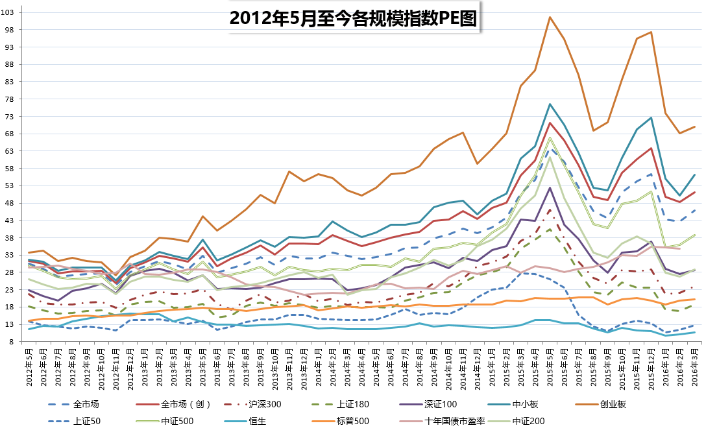
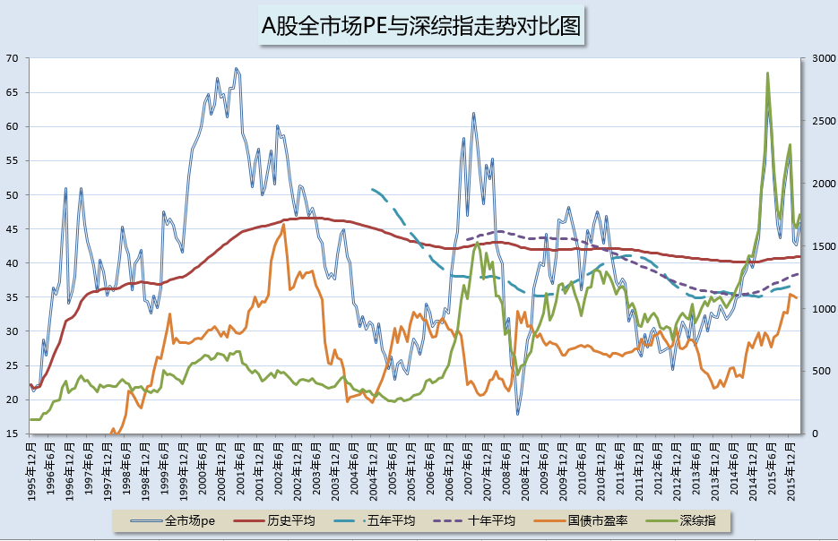

以前的投资笔记（001）：估值与趋势结合

本文不含任何股票推荐，只有本人对于投资体系和市场状态的一点思考与记录。

根据目前市场状态，精选以往内部投资笔记中相关部分原文发布于此。文末会略作回顾与反思，或查疑补缺，或继续深化。

之前看过的朋友不必再看。本系列文章如有足够的朋友喜欢，会持续更新。如并不受大家欢迎，则随时中止。

本篇文章写于2016年3月8日 。

推荐优先使用安卓设备阅读。

**估值与趋势结合**

今天想跟朋友们讨论的，是将估值数据应用在趋势投资中的问题。

想说这个是因为刚才有一位朋友和我交流，他之前的投资都挺顺利，主要就是应用了估值和趋势。几次股灾可以说是毫发无损。本人投资十几年，实际上各种投资方式都尝试过。其中有一部分现在还在用。趋势投资与量化趋势投资也是我会涉猎的一部分。

其实对于量化趋势投资来说，策略非常非常非常多。大多数策略的回测结果也都还不错。举个例子吧。

有个策略是将中证500和沪深300组成一个组合，然后观察他们与20日线的关系。如果300比20日线高10%，而500高30%，那么就持仓500。（以当日价格对比20日线，持仓比价高者）如果两者都比20日线低，则空仓。每日调仓。

当然，这个例子中，你完全可以将500换成创业板，也可以将300换成50。或者，干脆换成任何你喜欢的指数——注意，要风格大不相同的。

这样的策略有什么问题呢？我们来分析一下这个策略。

首先，它是一个趋势策略。也就是说，当指数涨到20日均线上方，才有可能开始持股。这个策略大概率会躲过大熊市中的大部分暴跌。其次，它大概率会享受到牛市中的大部分上涨。

其次，它是一个量化策略。也就是说他会择强持有。这样的话，在2013-2014年底，你就会持有小指数赚钱。而到了2014年底-2015年初，又会持有大指数。2015年上半年又会换成小指数——你看，感觉是不是很棒？简直A股的钱都让你赚了。

那么问题在哪里呢？问题就在于，它与所有趋势策略有一个相同的毛病：在不断的横盘波动中，会被不停的打脸。打脸。打脸。会让你不断的亏钱，亏钱。最终，你会坚持不到光明到来的那一刻。

雪球有个模拟盘，在2010年到2014年中，这个组合没有任何涨幅。也就是说，4年，它还在赔钱。你，能接受吗？我想大概率你坚持不到2014年底大爆发（3倍）。

好了，有意思的地方来了，我们的屠龙宝刀——估值，能不能运用在这种趋势策略中呢？

我给大家提供一点思路：

大家应该还记得早在2010年我就提出的八根估值带——以十年平均为中值，以历史最高最低为高低点，上下各画出四条等值估值带。距离中值最近的两条估值带为不买不卖区域，而向上一次是小卖到大卖，向下为小买到大买区域。

ok。如果你想结合我们的估值带，运用趋势策略，是否合适呢？

举例来说，在估值最高的那条估值带中，本来应该是清仓区域了，但你可以留20%-30%机动仓位。当条件满足上面说的趋势策略时，你就直接加到20%-30%仓位。不满足条件就卖出清仓。这样，你不仅可以赚到全民疯狂的最后阶段，也控制住了风险，不至于在突如其来的千股跌停里面损失太多。

同时，你可以在估值最低的区域这样做。那个区域如果你自己定义为70%-80%仓位区域，那你可以另外拿出20%-30%仓位做为机动仓位。做法如上。这样的好处是什么呢？好处是你的大部分仓位都坚如磐石的锁住了低位筹码，而还有一部分机动部队在帮你赚趋势策略的钱。

这整个系统中，坚如磐石的价值投资占主流，估值最大的用处“调控仓位”起到了作用。另外还有一部分仓位做趋势，低买高卖。

大家要注意一点，今天我说的趋势策略，不是我自己在用的策略。只是拿出来举个例子。趋势策略有很多很多很多，你可以去找一个最棒最适合你的。

其次，今天趋势与估值的结合也只是举个例子，不是让你真的这么做。你可以想出各种方法将你的趋势策略与估值结合，最大限度的消除趋势策略的弊端。

总而言之，这张估值表的作用和潜力非常非常大，你可以用它做的事情很多，还希望大家多多挖掘。 

附图：2016年3月8日的估值图

**今日点评：**

这篇文章表面看起来是介绍了一个趋势与量化结合的例子，实质上是深入思考了我的投资体系中“融合”这一真正本质的东西。

我本人并不相信人类真的有预测未来的能力，也相信绝不会有人能持续正确预测股市中短期走势。甚至，大多数人连长期走势都预测不到。所以我，以及绝大多数人需要的是一套机械化的投资体系，帮助自己完成交易。换句话说，你这个人只是投资程序的设计者，以及程序输出交易指令后的操作者。整个类似于AI交易的过程中，你并不参与决策，只是设计和执行者。

在设计交易体系的时候，我本人将趋势、量化和价值全部融合在内。在我的头脑中，从来不会有各种条条框框禁锢我。只要有用的我就拿来用，什么价值投资才是王道，什么趋势投资都是赌徒之类的说法我完全不屑一顾。存在即合理，一种交易模式存在就必定有它的优点。我要做的是把它的优点分解出来，融入我的交易体系。

正文中只是举了个例子，希望抛砖引玉，能够引发各位的深入思考，设计出符合自己情况的，优秀的交易体系。在以后的文章中，我会持续、深入介绍我本人的交易体系，以及融合了哪些投资策略在里面，希望能尽自己所能给各位一些小小的启发。

最后说一点，这是我的第一篇付费公众号文章，只是一个尝试。是否继续下去要综合各种情况。但无论如何，希望我的文章不会让你觉得掏出的3块钱不值。