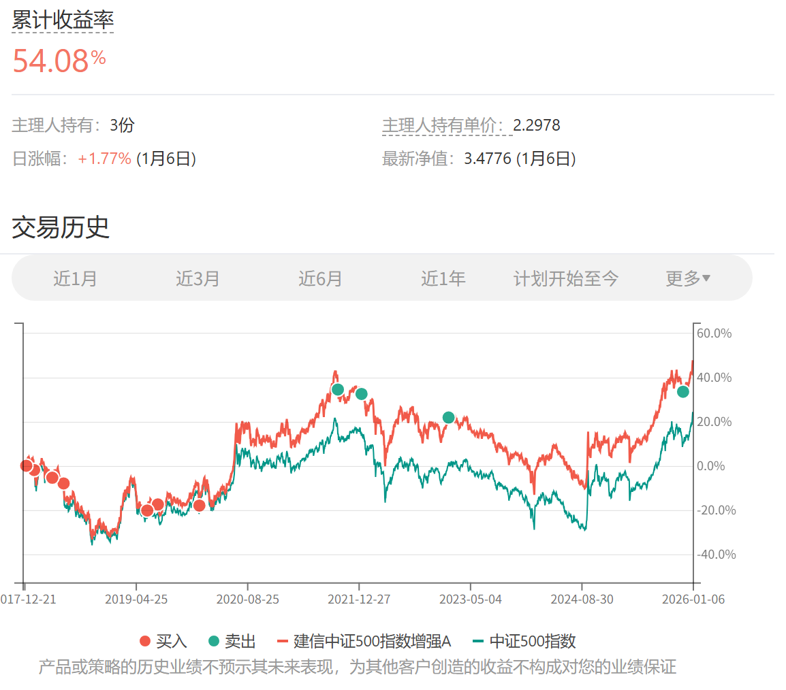
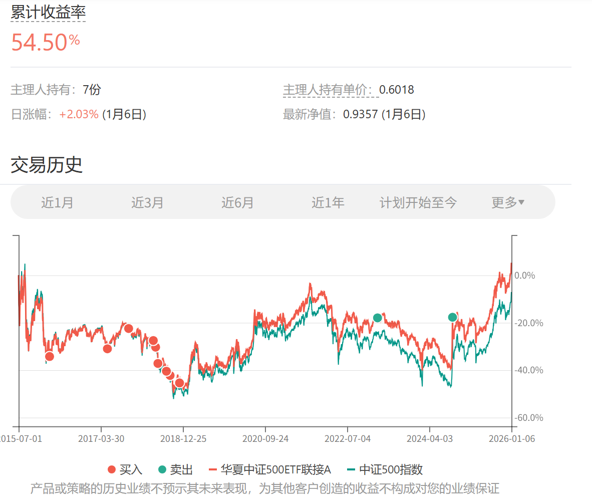

# 2026年1月长赢指数投资计划（一）

> ## Excerpt
> 150计划：\x0a\x0a卖出一份建信500（场外000478）\x0a\x0a卖出一份华夏500（场外001052）\x0a\x0a买入一份汇添富消费（场外000248）\x0a\x0aS计划：\x0a\x0a卖出一份建信500（场外000478）\x0a\x0a买入一份汇添富消费（场外000248）\x0a\x0a\x0a我们每一个人从小就被教育要做好人。\x0a\x0a那么什么是好人。我想，愿意帮助别人应该是“好人”的一项特质。\x0a\x0a在资本市场上，我们也应该做好人。\x0a\x0a热门的品种，就是有很多人抢。他们抢不到，我们就把自己的分一点给他们，这样，每个人都拿到了自己想要的。多好。\x0a\x0a被嫌弃的品种，就是没有人要。有人手里有，急着出手，我们就拿钱买一点过来，为他们分担一些痛苦。也很好。\x0a\x0a我相信好人有好报。\x0a\x0a今天，我们把平均收益率50%-60%以上的中证500分一些给别人，把辣鸡消费买一些回来。\x0a\x0a希望我们每一个人都有好报。\x0a\x0aPS：请各位注意，这个投资计划不是为你量身打造，未必适合你，参考之前，请三思而后行。\x0a\x0a\x0a特别提示：\x0a\x0a本次场外基金交易内容并非为非长赢投顾客户提供任何投资建议，且发车品种仅针对场外基金投资，请勿根据发车信息进行任何场内操作。\x0a\x0a基金投资组合策略的风险特征与单只基金产品的风险特征存在差异。投资者应自行阅读相关法律文件，自行作出投资选择。

---
150计划：

卖出一份建信500（场外000478）

卖出一份华夏500（场外001052）

买入一份汇添富消费（场外000248）

S计划：

卖出一份建信500（场外000478）

买入一份汇添富消费（场外000248）

我们每一个人从小就被教育要做好人。

那么什么是好人。我想，愿意帮助别人应该是“好人”的一项特质。

在资本市场上，我们也应该做好人。

热门的品种，就是有很多人抢。他们抢不到，我们就把自己的分一点给他们，这样，每个人都拿到了自己想要的。多好。

被嫌弃的品种，就是没有人要。有人手里有，急着出手，我们就拿钱买一点过来，为他们分担一些痛苦。也很好。

我相信好人有好报。

今天，我们把平均收益率50%-60%以上的中证500分一些给别人，把辣鸡消费买一些回来。

希望我们每一个人都有好报。

PS：请各位注意，这个投资计划不是为你量身打造，未必适合你，参考之前，请三思而后行。

特别提示：

本次场外基金交易内容并非为非长赢投顾客户提供任何投资建议，且发车品种仅针对场外基金投资，请勿根据发车信息进行任何场内操作。

基金投资组合策略的风险特征与单只基金产品的风险特征存在差异。投资者应自行阅读相关法律文件，自行作出投资选择。

