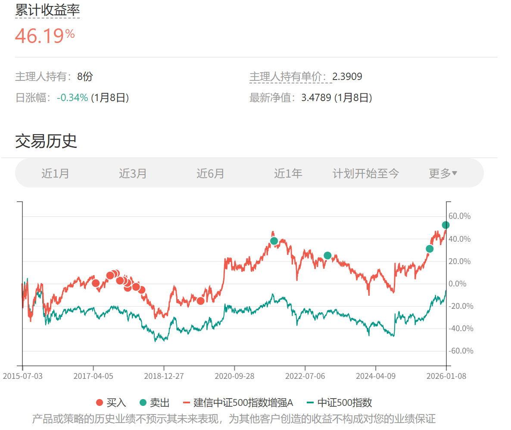

# 2026年1月长赢指数投资计划（二）

> ## Excerpt
> 150计划：\x0a\x0a卖出一份建信500（场外000478）\x0a\x0a\x0a目前500碰到了小压力位，继续缓慢减持一份。\x0a\x0a之后到大压力位，会进行更大笔减持。现在看起来并不遥远。\x0a\x0a\x0a特别提示：\x0a\x0a本次场外基金交易内容并非为非长赢投顾客户提供任何投资建议，且发车品种仅针对场外基金投资，请勿根据发车信息进行任何场内操作。\x0a\x0a基金投资组合策略的风险特征与单只基金产品的风险特征存在差异。投资者应自行阅读相关法律文件，自行作出投资选择。

---
150计划：

卖出一份建信500（场外000478）

目前500碰到了小压力位，继续缓慢减持一份。

之后到大压力位，会进行更大笔减持。现在看起来并不遥远。

特别提示：

本次场外基金交易内容并非为非长赢投顾客户提供任何投资建议，且发车品种仅针对场外基金投资，请勿根据发车信息进行任何场内操作。

基金投资组合策略的风险特征与单只基金产品的风险特征存在差异。投资者应自行阅读相关法律文件，自行作出投资选择。

