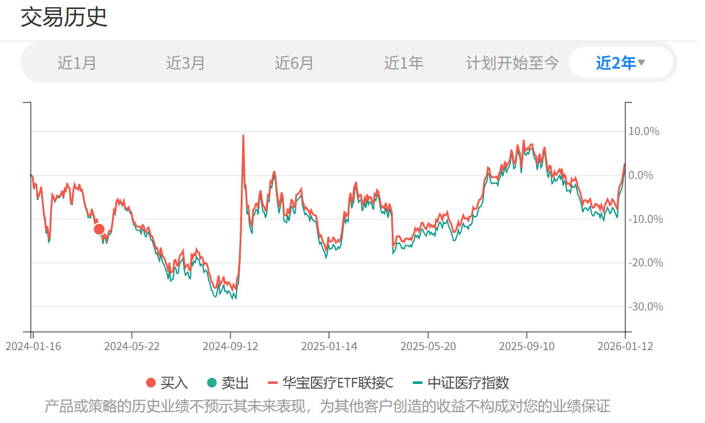

# 2026年1月长赢投资计划（三）（卖出部分）

> ## Excerpt
> 150计划：\x0a\x0a卖出一份华宝医疗C（场外012323）\x0a\x0a\x0aS计划：\x0a\x0a卖出一份华宝医疗C（场外012323）\x0a\x0a\x0a\x0a这份卖出，是C类波段操作。该笔波段收益率在19%左右。\x0a\x0a这几年，医疗的波段做的不好。很大程度上是因为声音太杂，我顾虑太多，患得患失。结果就是这两年只在医疗C一个品种上，就至少失去了3-4次波段提款机会，整体医疗C的收益率至少少了20%。\x0a\x0a未来不会了。因为，这是我自己的投资计划。无论各位是否能理解我的波段操作，对我来说都不重要。\x0a\x0a另外跟各位报告一下。\x0a\x0a从这次发车开始，公众号只会推送本计划的卖出交易，不再推送买入交易。（在今日之后的新买入，导致的卖出也不再推送）\x0a\x0a同时，从今年1月1日起，在且慢的长赢投顾也已经关门，不再接受新人跟车。\x0a\x0a请之前在公众号跟车的朋友放心，您既然相信我，之前参考了我的交易买入，我一定会把您送到盈利卖出那一天，绝不可能把您扔在半路。我做不出那种事。\x0a\x0a之前每一次市场高位，我都会不停的劝，劝新人不要跟车，因为值搏率已经很低。我们在高位的买入，绝大多数都是换仓，换掉已经拿到大额收益的品种，有了很厚的安全垫后，再少量买入新的风险小一些的品种。\x0a\x0a但是对于新人来说根本就没有利润安全垫，牛市中开始跟车风险太大。\x0a\x0a可惜事后看，基本没有成功过。新人在牛市依然入市跟车，导致被套几年。\x0a\x0a这次，我就干脆不再公开发布买入交易。新人就完全没法在高位跟车。\x0a\x0a请各位理解，我做的所有事情，是为了保障各位的利益。\x0a\x0a当然，不在公众号发车，也有对于跟投投顾朋友公平的考虑。\x0a\x0a总而言之：\x0a\x0a已经在车上的朋友，我会把每一个品种做到盈利后，帮您安全卖出下车。\x0a\x0a没有上车的新朋友，在市场高位，我也不会再让您有机会跟投我的组合。我是对您负责才会这样做。\x0a\x0a就这样。请您谅解。\x0a\x0a另外，如果您实在想买，也喜欢投顾这种模式，这个市场上还有很多比我优秀的投顾，您可以参考他们的组合。如果不喜欢这种模式，相信您也能找到很多更好的、更适合您的投资策略来指导买入。\x0a\x0a牛市中主动不再接受新人跟投，这样的事情没几个人会做。再次提请理解我的苦心。祝各位投资顺利！\x0a\x0a\x0a特别提示：\x0a\x0a本次场外基金交易内容并非为非长赢投顾客户提供任何投资建议，且发车品种仅针对场外基金投资，请勿根据发车信息进行任何场内操作。\x0a\x0a基金投资组合策略的风险特征与单只基金产品的风险特征存在差异。投资者应自行阅读相关法律文件，自行作出投资选择。

---
150计划：

卖出一份华宝医疗C（场外012323）

S计划：

卖出一份华宝医疗C（场外012323）

这份卖出，是C类波段操作。该笔波段收益率在19%左右。

这几年，医疗的波段做的不好。很大程度上是因为声音太杂，我顾虑太多，患得患失。结果就是这两年只在医疗C一个品种上，就至少失去了3-4次波段提款机会，整体医疗C的收益率至少少了20%。

未来不会了。因为，这是我自己的投资计划。无论各位是否能理解我的波段操作，对我来说都不重要。

另外跟各位报告一下。

从这次发车开始，公众号只会推送本计划的卖出交易，不再推送买入交易。（在今日之后的新买入，导致的卖出也不再推送）

同时，从今年1月1日起，在且慢的长赢投顾也已经关门，不再接受新人跟车。

请之前在公众号跟车的朋友放心，您既然相信我，之前参考了我的交易买入，我一定会把您送到盈利卖出那一天，绝不可能把您扔在半路。我做不出那种事。

之前每一次市场高位，我都会不停的劝，劝新人不要跟车，因为值搏率已经很低。我们在高位的买入，绝大多数都是换仓，换掉已经拿到大额收益的品种，有了很厚的安全垫后，再少量买入新的风险小一些的品种。

但是对于新人来说根本就没有利润安全垫，牛市中开始跟车风险太大。

可惜事后看，基本没有成功过。新人在牛市依然入市跟车，导致被套几年。

这次，我就干脆不再公开发布买入交易。新人就完全没法在高位跟车。

请各位理解，我做的所有事情，是为了保障各位的利益。

当然，不在公众号发车，也有对于跟投投顾朋友公平的考虑。

总而言之：

已经在车上的朋友，我会把每一个品种做到盈利后，帮您安全卖出下车。

没有上车的新朋友，在市场高位，我也不会再让您有机会跟投我的组合。我是对您负责才会这样做。

就这样。请您谅解。

另外，如果您实在想买，也喜欢投顾这种模式，这个市场上还有很多比我优秀的投顾，您可以参考他们的组合。如果不喜欢这种模式，相信您也能找到很多更好的、更适合您的投资策略来指导买入。

牛市中主动不再接受新人跟投，这样的事情没几个人会做。再次提请理解我的苦心。祝各位投资顺利！

特别提示：

本次场外基金交易内容并非为非长赢投顾客户提供任何投资建议，且发车品种仅针对场外基金投资，请勿根据发车信息进行任何场内操作。

基金投资组合策略的风险特征与单只基金产品的风险特征存在差异。投资者应自行阅读相关法律文件，自行作出投资选择。

