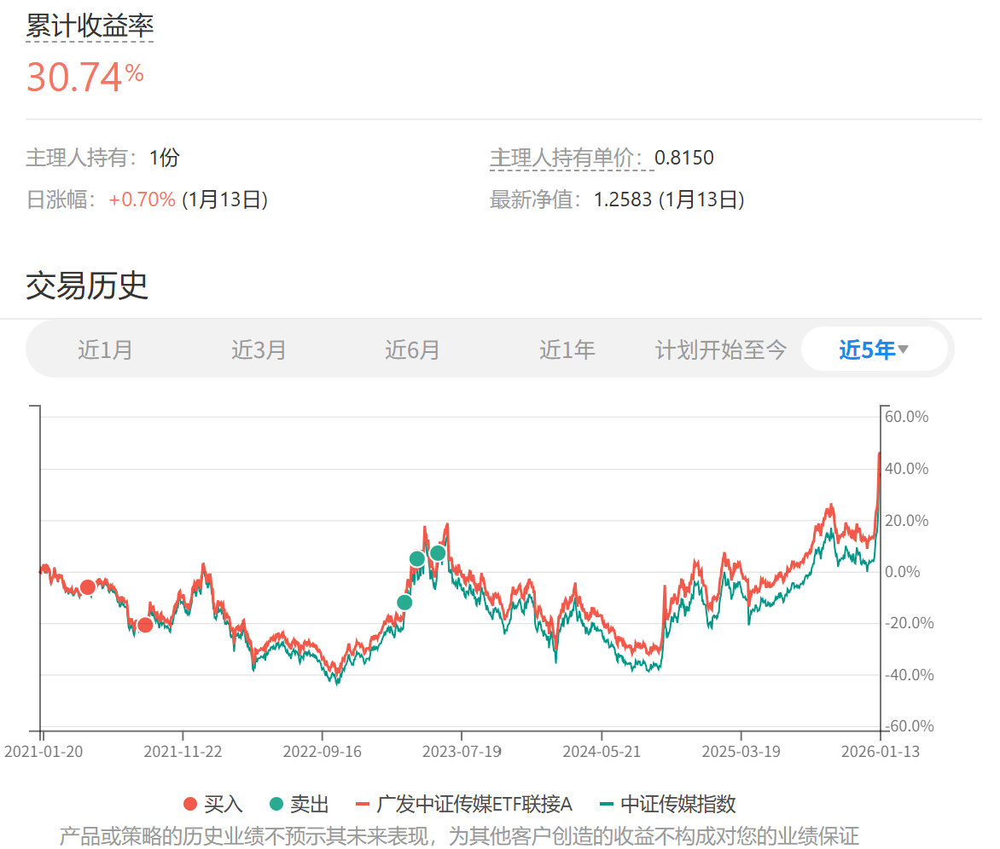

# 2026年1月长赢投资计划（四）（卖出部分）

> ## Excerpt
> 150计划：\x0a\x0a卖出一份中证传媒（场外004752）\x0a\x0a\x0aS计划：\x0a\x0a卖出一份中证传媒（场外004752）\x0a\x0a\x0a这次是右侧卖出。这一份传媒卖出后，传媒仓位在两个计划中就已经清仓了。\x0a\x0a这个品种，每位朋友的最终收益率差很多很多。基本在40%——90%之间。小部分根据提示补仓的朋友也有翻倍以上。\x0a\x0a未来如果有机会，我们还会买回来。而且之后会比这次好很多。那时候，会坚决贯彻波段操作。这个品种是波段之王。\x0a\x0a获利清仓的这一天，我又记起了我们持有它浮亏的时候，是怎么被人破口大骂，怎么被大V嘲笑鄙视的。\x0a\x0a这就是人生吧。多有意思。\x0a\x0a长赢。\x0a\x0a再次提示，以后本公众号只发布第三轮计划的卖出交易。原因请移步2026年1月13日的公众号文章浏览。\x0a\x0a特别提示：\x0a\x0a本次场外基金交易内容并非为非长赢投顾客户提供任何投资建议，且发车品种仅针对场外基金投资，请勿根据发车信息进行任何场内操作。\x0a\x0a基金投资组合策略的风险特征与单只基金产品的风险特征存在差异。投资者应自行阅读相关法律文件，自行作出投资选择。

---

150计划：

卖出一份中证传媒（场外004752）

S计划：

卖出一份中证传媒（场外004752）

这次是右侧卖出。这一份传媒卖出后，传媒仓位在两个计划中就已经清仓了。

这个品种，每位朋友的最终收益率差很多很多。基本在40%——90%之间。小部分根据提示补仓的朋友也有翻倍以上。

未来如果有机会，我们还会买回来。而且之后会比这次好很多。那时候，会坚决贯彻波段操作。这个品种是波段之王。

获利清仓的这一天，我又记起了我们持有它浮亏的时候，是怎么被人破口大骂，怎么被大V嘲笑鄙视的。

这就是人生吧。多有意思。

长赢。

再次提示，以后本公众号只发布第三轮计划的卖出交易。原因请移步2026年1月13日的公众号文章浏览。

特别提示：

本次场外基金交易内容并非为非长赢投顾客户提供任何投资建议，且发车品种仅针对场外基金投资，请勿根据发车信息进行任何场内操作。

基金投资组合策略的风险特征与单只基金产品的风险特征存在差异。投资者应自行阅读相关法律文件，自行作出投资选择。