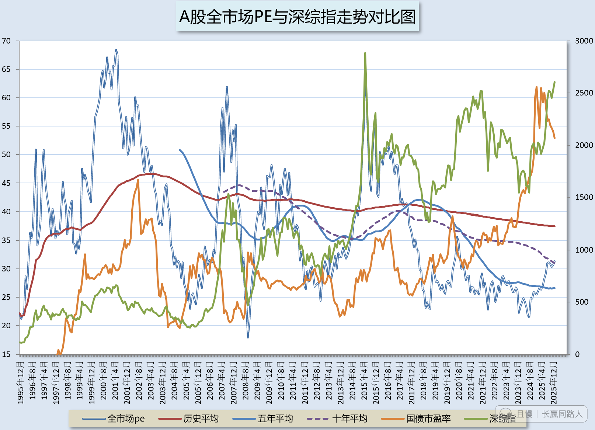

今日收盘，全市场估值有两个看点。

第一，达到最近五年最高。是2020年9月以来最高。再之前就是2018年5月了。

第二，正式超越最近十年平均值。

再次提请新朋友注意，这些关键位置的一些节点，不代表马上就要跌，一定跌。只是从数据方面给您一个参考。让您知道现在的情况。

类似于什么呢。

类似于温度计。

它会告诉您，现在的温度是多少度，是夏天还是冬天。但它并不能确切的告诉您，明天天气一定会怎样。

所以，咱们就按照对待温度计的态度去对待它：

天冷了，咱们就多穿点。天热了，就少穿两件。

总比迷迷糊糊，一天天什么都不知道，就在股市里傻乐傻疯强点吧。

您说呢。

以后每次到了有意思的情况，都会在小组更新估值图。

ETF拯救世界
反正我现在肯定不会在A股加仓了。

新米练习菌
谢谢分享，神图再现，迷雾散去。

新米练习菌
嗯嗯，明白，贵不代表立马跌。
就像天气热，看到温度计显示高温，也不代表立马就会转凉降温，甚至还会爆晒也未可知。
放大了，仔细看了看，前几个月“将碰未到”十年均线就调头下来了一下下，现在又上去了，
正式碰到，2017年跌破十年均线之后，第一次誒。
2020年7月的几天疯🐮，也未触碰到十年均线就掉下了。
如今，深综指已经2625点超过2021年高点2571点，成为次高点了，最高就是2015年的3157点了。
PS:国债市盈率还是高高在上，也是奇观…

新米练习菌
意味着 国债收益率低，现在只有1.9%，「债」的性价比不高…
国债市盈率=国债收益率的倒数

