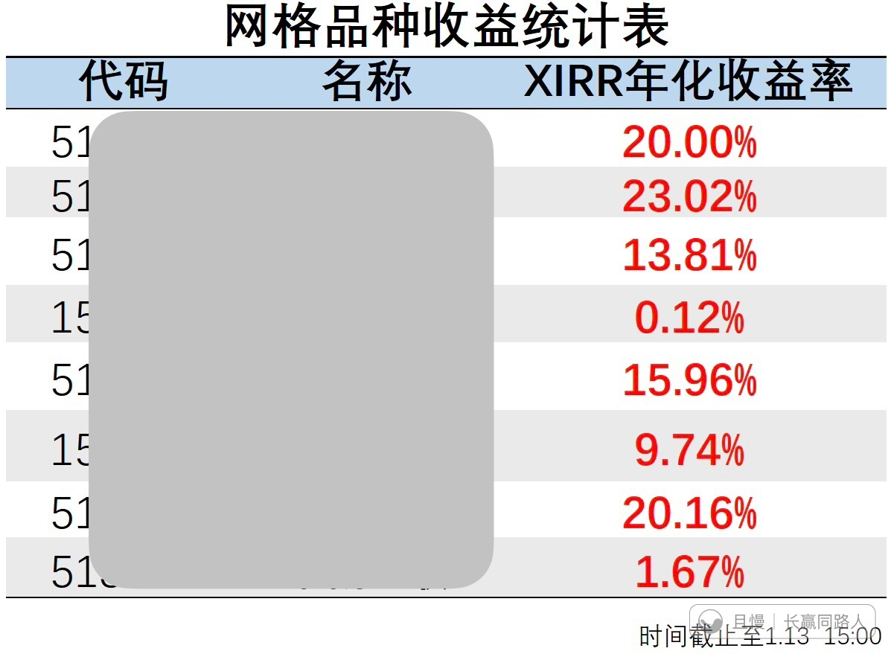

我告诉所有人。

场内的网格交易，没有任何人有疑问。最后，大家也拿到了非常非常满意的收益率。

长赢的波段，从一开始做就没完没了的质疑。

“整体持仓还亏损为什么卖”

“卖了一份怎么还涨”

“卖飞了！”

不胜其烦。

这几年被这些声音，搞得我患得患失，前思后想，波段部分根本无法像场内一样不断提款。

就拿今天的医疗C来说，正常情况至少已经提款3/4次，整体利润至少20%以上了。

我受够了。

那些不学习话还多的，我不会再理会你们怎么说。看不懂就看不懂，爱说什么就说什么。

我不会再让你们影响我的操作。不会再因为你们，让那么多朋友的利益受到损失。

任何声音影响我操作的时代已经结束了。

勾勾同学
E大 不用解释的 私募每年管理费两个点 盈利提成20%都没有解释 你干嘛要解释这么多啊 拿地沟油的待遇 操卖白粉的心

> ETF拯救世界
> 私募不用展示每一笔交易，好做太多了。我是每一笔交易都要被审视

新米练习菌
根据券商的表格，我一直在统计【场内波段账户】的情况
今天早晨因为第二次卖出CM的利润持仓，刚刚更新过：
【网格波段 账户汇总】
XIRR年化 持仓收益率 提款次数 运行天数
9.7% 79.4% 109 2171
品种 代码 XIRR年化 持仓收益率 提款次数 运行天数
51**** 20.19% ∞ 22 1855
51**** 11.98% 138.56% 9 1765
15**** 0.14% 0.55% 13 1874
15**** 9.71% 128.36% 28 2171
51**** 13.83% 106.99% 15 1469
51**** 1.63% 10.14% 8 1651
51**** 17.81% 130.29% 8 2171
51**** 29.97% ∞ 6 1418
（没法贴图，凑合着看吧，还有个品种尚未开始，就不放了。放交易过的这些。）

新米练习菌
又要跟，又不信，
想知道，又不学，
又要无脑，又要话多，
又不动脑，又要质疑。
烦死了。
“那些不学习话还多的，我不会再理会你们怎么说。看不懂就看不懂，爱说什么就说什么。“
太好了。
其实别人没有逻辑地随口一问，或者不过脑子地张口就来，可能也就几秒，但对于逻辑性非常强的人来说，是本能启动第二层思维，会习惯性地思考起来，大脑是很耗能的，再回复再表达，无论多快，都是需要时间和精力的。
非常不对等，不理会是最好的。
不然对于爱思考、爱学习的人是非常不公平的。
——你可以“不懂就问”，
——我也可以“不想回”。
爱跟不跟，爱看不看，爱信不信，爱懂不懂，
爱说啥说啥，爱咋咋，那是对方的课题。
课题分离，各自安好。

Petf
我有个疑问没想明白，望各位大佬指教
就是波段为什么不在场内做，要做到长赢里？
本人认识E大10天，就把当时所有存款都买了长赢，后来网格全跟上了，又增加了几个长赢，非常感激E大，收益颇深，微博只看E大，不更之后，在也不看微博了，绝对E粉。

> 新米练习菌 > Petf
> 首先，上面统计的就场内。
> 另外，也要考虑体量，规模，场内冲击风险，门槛…等各种问题。
> 然后，“微博只看E大，不更之后，再也不看微博了”，这不太合适…（也许是我话多了，可以看E大之前的WB）
> E大的历史资料非常重要，所有的发言可不是一个实时资讯、即时信息，而是一整套完整的体系学问。学习的朋友们一直都在考古，反复都看过往的很多资料。
> 稍微往前翻翻就知道为什么长赢会增强波段力度，我想看到了就不会有这样的疑问了，很多东西，老大以前反复说过好多次，很多问题的答案就在历史发言中。
> 多翻翻过往的，包括老大二十多年来在几处平台的发言，串起来，会更好地看懂眼前，也能更好地理解现在和未来说的东西。