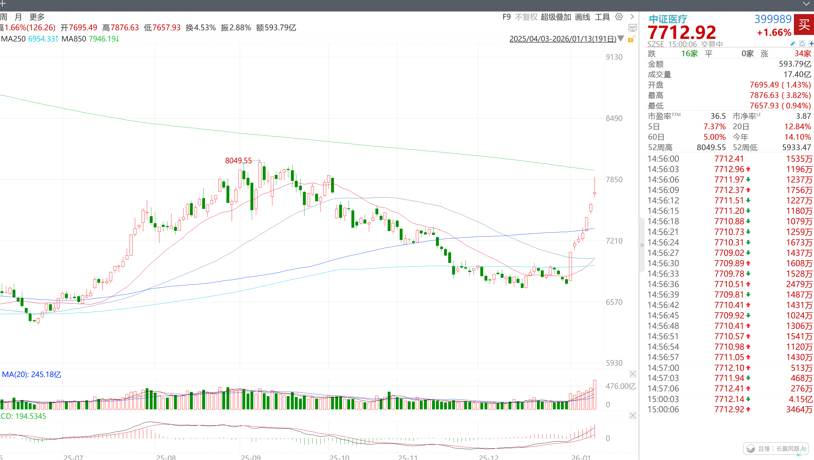

解读一下今天医疗的卖出。

首先，很多朋友判断的不错，今天的卖出，实际上是技术与策略的共振。

技术方面，我的交易体系中重要均线850线近在咫尺。

策略方面，距离上一次买入，利润已经有了20%左右。这样的波段利润甚至已经是一个中网级别了。

这次卖出后，所有朋友都会在心理上产生一定“涨跌都舒服”的状态。

跌了，未来会把这份卖出重新买回，反复吃，反复收割，反复提款。

涨了，大仓位的医药开始给组合贡献利润。

重新做回自己，瞬间让一个死气沉沉的品种变得灵动可爱有没有。

后市：

今天医疗这根长上影，其实跟它本身无关。相对来说，它今天是很强的。只是被大盘带了下来。

之后如果大盘稳住，相信医疗还有再次挑战850线的机会。但是能否过去，就真的不好说。

无论如何，今天的卖出，已经可以让咱们在心态上已经比之前好太多了，你说是不是。

波段操作，实际上就是在低位区域震荡时，降低成本的同时平稳心态的交易策略。之后你会越来越懂。

至于下次买回是在什么部位，欢迎继续关注。

舒服就行_踏踏实实的
回撤超过五个点后择机买入

> ETF拯救世界
> 五个点不可能。幅度一定是比这个大。
>
> 战火小阿蛮 > ETF拯救世界
> 这个老大好像之前讲过、指数类短期时间内剧烈下跌、比如一个月或者2周左右至少要📉10%才考虑接回来、点位大概在6940附近、正好在250日线下面一些些。如果时间拉长的话我就不知道了。

新米练习菌
“重新做回自己，瞬间让一个死气沉沉的品种变得灵动可爱有没有。”
🈶🈶🈶。
“今天的卖出，已经可以让咱们在心态上已经比之前好太多了，你说是不是。”
是是是。

新米练习菌
“今天医疗这根长上影，其实跟它本身无关。相对来说，它今天是很强的。只是被大盘带了下来。”
哦哦哦，原来如此，这个不是很懂，没想太多，只是看到收盘红着，还是放量的，仅次于24/10/8的量。今天A，日常follow的指数们里，只有医药系、传媒、金融系红着。
医药系没有被带着泥沙俱下一起绿已经很出息了。

花花花世界不必当真
250线和850线通常指股市中的250日均线（年线） 与850日均线（超长期线），是判断长期趋势的关键指标。
核心定义与用法
- 250线（年线）：约1年交易日的平均价，被视为牛熊分界线，股价在其上常被认作多头，其下为空头，也是重要支撑/压力位。
​
- 850线（基钦周期线）：约3.5年交易日的平均价，对应基钦短周期，用于判断超长期趋势，是长线布局的重要参考。
实战要点
- 两线多作为长期支撑/压力，股价遇线常盘整，放量突破并站稳后，可作为低吸信号。
​
- 不能单靠两线决策，需结合基本面、量能、行业周期等综合判断。
😁😅又学到一个知识点