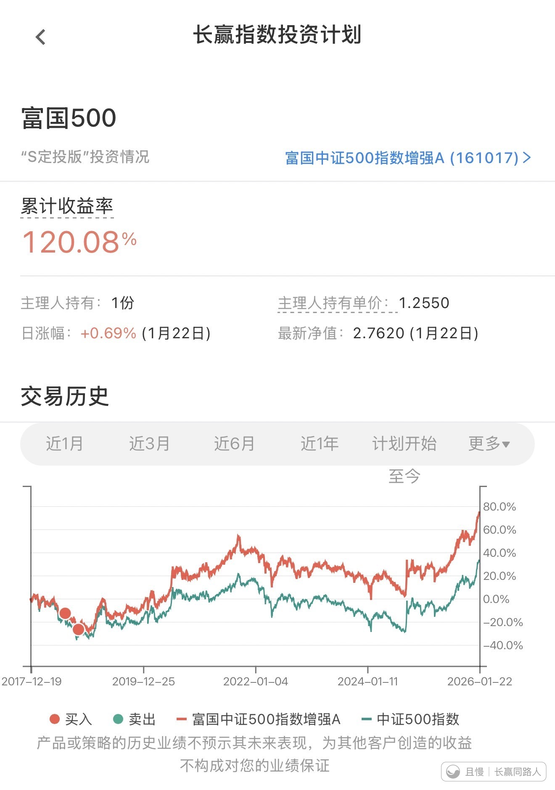

有人在卖，咱们也卖。

不同的是咱们的收益率要比他们高太多了，虽然时间也长了几年。

今天是一个值得纪念的日子。所有今天卖出的朋友都会拿到110%−120%的收益。只要不是自己开黑车，没人会低于这个数字。

买得低，拿得住，所有朋友都配得上这个收益。

新米练习菌
Repo: 中证500，今日8590点。
【点位笔记】中证500（000905）
小压力位：8100左右
大压力位：8500左右
【E据】
【20260121】500眼看就要阶段新高
未来会按照计划，在8500附近一线（外太空分界线）减持。
但是减持力度会比之前预想的要弱一些，因为目前看行情还比较温柔。
【20260108】说几句中证500的操作和明牌。
价值方面，目前中证500估值过去5年最贵，过去10年80%左右分位。相对价值来看，已经相当不便宜了。
技术方面，之前给的明牌小压力位在8100左右，大压力位在8500左右。
【20251229】中证500大幅减仓位置
当初的8100是2023年，目前已经上移。最新：8100已经降格成为小幅减仓点位，大幅减仓点位上移至8600-8700一线。
任何指数的致敬点位和外太空点位，极大概率都是要随着时间的推移不断上移的。这是金融和货币的规律。

新米练习菌
【留言2】"有人在卖，咱们也卖。"之“有人”
GJD-汇J （1 月 14 日~1月21日）对中证 500ETF 有过减持（约 24%），力度弱于科创 50、中证 1000、创业板，强于沪深 300。
统计口径略有差异，看看用宽基减持比例用：
科创 50ETF：近清仓（80%+）
创业板 ETF：约 40%
中证 1000ETF：约 38%
中证 500ETF：约 24%
沪深 300ETF：约 15%
整体是 “涨得多、估值高的先减”。