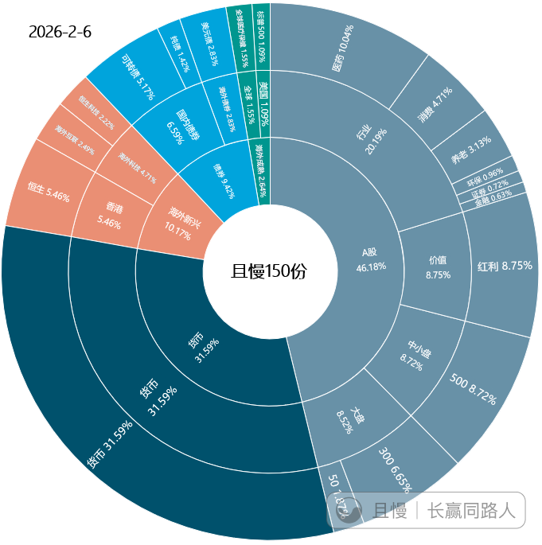

快过年了，锐评一下目前150的持仓。

说说满意的和不满意的地方。作为记录和警醒。

首先比较满意的:

海外新兴的总仓位。10%左右，目前比较合适。不足的是中概恒科比例大一些。如果有两份换成其它品种，比如港股红利会更好一点。但是问题不大，有机会再调。

A的大盘/中小盘/价值仓位配比。1:1:1，经过不断调仓，已经趋于完美。未来只要切换更合适的品种即可。

不满意的:

债券仓位少。目前6个多点，少了一半左右。

美债仓位少。少了几个点。

美股等成熟市场仓位少。少了接近10个点。

黄金仓位消失。卖出清仓过早。少了5个点。

A股总仓位高了点，目前40%左右合适。其中行业仓位略高了几个点。

现金仓位过高。

对于我们这样规模的计划来说，有些不合理的仓位调仓很难，因为买不到。比如美股美债。也有些品种太小，无法容纳我们，比如德国日本。但是未来有机会解决的。只是未来有好机会买到，请各位不要再去外面瞎咧咧了。

整体看，还算可以。未来会在合适的时间，把仓位调到合适。

所谓合适，就是“可以传几代”的配置。

ETF拯救世界
所有目标仓位，只是适合目前情况的。这个是不断变动的

新米练习菌
“可以传几代”~一辈子的资产配置😊
我早晨也拉了数据，效仿官方原版做个了新的，供参考今日数据：
【150】仓位 (2026-02-12)
A： 45.83%
H：10.20%
A+H：56.03%
股：58.68%
现金：31.89%
===下一层===
价值 8.27%
大盘 8.61%
中小盘 8.92%
行业 20.03%
海外科技 4.71%
香港 5.49%
国内债券 6.64%
海外债券 2.79%
全球 1.55%
美国 1.10%
===所有仓位相关的【图】===
放这里：
https://qieman.com/content/content-detail?postId=67243

新米练习菌
【留言2】一些仓位笔记
💎1）美股：10%~15%
【20250403】理想状态至少至少10巴仙。
【20250407】未来，美股会在我们的长线计划中占有10%-15%的仓位。今天只是一个开始。我们还有巨量的资金等着它继续回归价值。
💎2）美债：5%~8%
【20241031】
问：老大，美债计划给多少仓位？
E大：至多5-8。
【20241108】
E大：一天翻红了。找机会继续买。希望跌。买足5-8。又要到饭了兄弟们！
💎3）现金
【20241024】随着逐渐减仓，150的现金储备已经达到了21%。一个正常的，可以贯穿一生的投资组合，我个人认为，现金最多不应该超过25%。
【20241210】现金拿到23%了，必须一定要持有什么品种了。因为25%是最高限度
【20260114】
jiearsenal: 正好红利再跌跌也到位了
E大：红利如果真的能跌到位，我就太高兴了。之后减持的资金我都不知道该干嘛。
💎4）A股 40%
【20260108】A股总仓位方面，以150为基准，如果市场出现超级过热的情况，我可以接受将仓位降至40%左右，甚至有可能会更低。

新米练习菌
【留言3】更多（所有仓位相关，最大仓位或者理想仓位）的发言笔记，更新在了这里：
https://qieman.com/content/content-detail?postId=66175
（2024年之前 & 2024年之后 ，分来收集和记录）