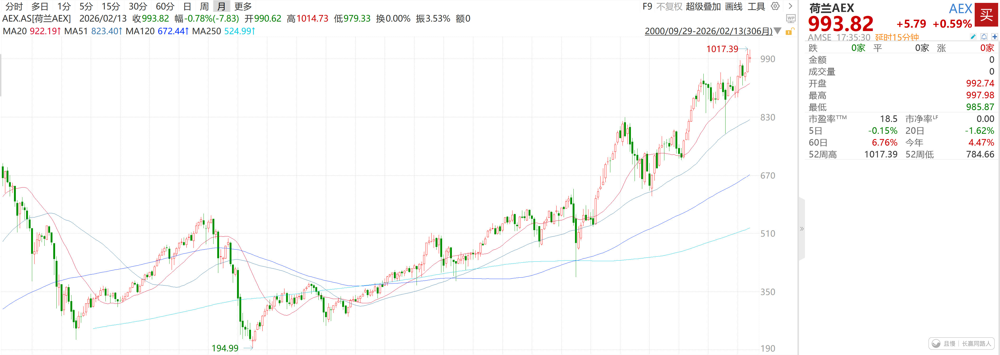

下图是荷兰股票指数。2005年至今，涨了200%多，跟沪深300差不多。

但是最近他们要出一个逆天的政策：针对未卖出的浮动盈利，征收36%的资产增值税……

其实世界上像我们这种资本利得以及分红都不征税（暂免）的市场并不多，一般都是实现收益后交税。比如分红或者卖出盈利品种后。

巴菲特之所以不喜欢让哈萨维分红，很大程度上就是因为分红要交税。

但是像荷兰这么逆天的，还没有实现的收益，也就是浮盈都要征收高达36%的税，就太逆天了。36%啊！

这么一比，A股就显得温柔多了。

欧洲完蛋了……

高海龙
浮盈也能征税？那明年跌了还能退税不？

> ETF拯救世界
> 不退。但是你明年的亏损，可以计入未来的盈利抵扣。

新米练习菌
E大下午好~
⊙ ⊙！「还没有实现的收益，也就是浮盈都要征」啊…
突然觉得A股挺好的。赢了（盈了）都是我的，我要在A股玩，我不要去欧洲玩。
-
资本利得税我是知道的，看那佬美写的投资书籍，都有提到过，所以他们有会选择卖出亏损持仓的策略，因为不用交税地换仓，算下来可能也不是那么地亏。
像我们这样每一笔交易都要盈利、每一个品种都要盈利，如果收那么多税，感觉就特别“凭什么啊”…还好不收，记得就股票分红，一年内卖出持股的话，分红的部分，会扣些税。
珍惜A股不收资本利得税，不收盈利税的日子，好好在A股玩~ 

新米练习菌
沪深300，基日 2004年12月31日，基点1000点，现在4660点，
嗯？沪深300至今涨了366%吧？好像比荷兰好誒~