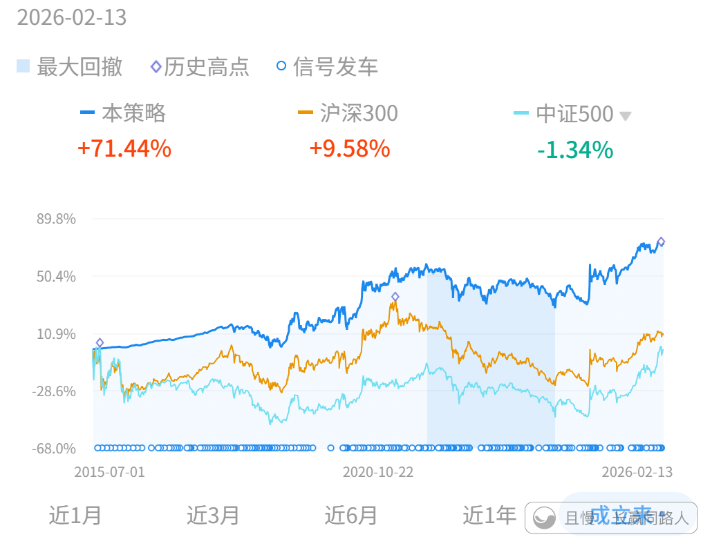

对两个经典投资问题的一点浅见——集中还是分散？
我来解释两个问题，这两个问题很多朋友做投资的时候会感到很困惑。我说说自己的理解，未必对，权作参考。

第一个问题：集中还是分散。

有朋友经常问，这个大师，那个大师都说了，要集中投资。为什么你会摊大饼什么都买。

我的回答：

你造吗，很多很多问题，都可以用我经常说的那个故事来解释：

小马过河。

“大师”之所以成为大师，有两个因素决定。

第一，能力。第二，运气。

实际上即使到终极大师最后羽化升天那一天为止，我们也很难说清，他们的成功到底是能力还是运气。又或者说，运气本身就是一种能力？

1000个大猩猩，一对一猜拳。最后一定有一个从第一把到最后一把全赢的。那么，他到底是猜拳能力强，还是运气好？

更不要提那些阶段性大师了。

我到底在说什么？

我在说，“集中”对大师来说，也许是正确的。因为可能他能力强，可能他运气好。但是……你呢。

你需要了解概率。

100年前，道琼斯工业指数中的成分股，现在都已经不在里面。大多数更是已经消失。

美股每年退市的股票比上市的还多。

根据测算，强如美股这样的长牛，其涨幅大多数都来自于不足10%的股票。剩下的90%，长期看都是在拖累大盘。

那么我请问，普通投资者，到底该如何从100支股票中，选出10支靠谱的。更何况这10支在超长的时间内，其中一半也可能消失？

集中也许没错，但你有那个能力或者运气吗？

如果成为巴菲特那么容易，为什么盘古开天辟地以来，全世界只有一个巴菲特？为什么巴菲特说自己走后，家族财产90%买标普500，而不是培养孩子去集中持有好股票？

我聊投资，从来不是从个体的角度出发。从来都是从“普通人”的角度去思考问题。普通人如何才能在市场中长期看能够不死，能够赚钱，能够不停新高，能够在熊市中不崩溃，这才是我要思考和讨论的问题。

这也是为什么我一直鼓励你去尝试各种不同风格的投资。那样，你才会知道你是天才还是普通人。你才能找到自己投资的路。

结论：小马过河。有能力有运气的去集中，普通人，分散！

第二个问题，为什么长期看跟上指数就会战胜绝大多数人。

如果你看过专业机构的报告，就应该知道，在股市，越有钱的人，赚钱的概率越大。资产10万以下的人赚钱的最少，几百万以上的大多数都在赚钱。

（当然，很难说清楚，是因为有钱而更赚钱，还是因为比较会赚钱而有钱）

这是什么意思呢。意思是，如果我们简单的把指数当做市场中所有资金的平均走势，那么，以“人”来划分，一定是有大多数人比不上指数。因为钱少的人多。

所以，长期能跟上指数，绝对会战胜市场中大多数甚至绝大多数人。无论在哪个国家，都会是这样。

对于A股来说，它的走势与几乎所有国家都不同，因为它是一个很有特色的市场。

这个市场，以我的理解，只要做到两件事，就能跑赢它，就能比绝大多数人强。

第一，熊市不亏或者少亏。

第二，牛市跟上7788。

不需要在上涨的时候跑赢它。因为上涨的时候跑赢，意味着你押注了某个涨幅凌厉的东西。盈亏同源，非常有可能在之后的市场中会坐电梯，把利润赔回去。

所以，只要下跌的时候控制跌幅（大多数时间都在跌），上涨的时候有筹码，差不多跟着涨，最终就能赚到钱，就会比绝大多数人强。

nekoxx
哥，你自己的股票投资是相对集中还是分散呢？可否透露一二。

> ETF拯救世界
> 非常分散。绝对的分散。尤其是资产越来越大后，更是越来越分散。

新米练习菌
最有名的“集中投资”大师巴菲特，恰恰是最力荐普通人投资指数的人
——他自己常年践行集中投资（重仓少数优质企业），但对绝大多数普通人，他的建议从来都是清晰且一致的。
他的建议还不够有说服力吗？

新米练习菌
【留言2】“集中大师巴菲特”建议的一些（原文）①：
-
【2013年致股东信（原文）】：
“我死后，给妻子设立的信托，只保留10%短期国债，其余90%全部放进低费率标普500指数基金；我相信这个策略的长期业绩，会打败绝大多数高费率投资者。”
他连自己家人的资产传承，都选择了指数基金，而非让家人去模仿他做集中选股，足见其诚意。
-
【2007年接受CNBC记者采访（原文）】：
“个人投资者，最佳选择就是买入低成本指数基金，并在一段时间里持续定期买入。”
这句话直接点明了普通人的投资最优解，避开了“选股难、择时难”的痛点。
-
【1993年公开演讲（原文）】：
“透过定期投资指数基金，一个什么都不懂的投资人通常都能打败大部分专业经理人，很奇怪的是，当傻钱了解到自己的极限之后，它就不再傻了。”
这正好对应了“普通人要认清自己，不要盲目模仿大师集中”，巴菲特早就看透，普通人的优势不在于“选对少数牛股”，而在于“跟上市场平均，不犯大错”。

新米练习菌
【留言3】“集中大师巴菲特”建议的一些（原文）②：
-
【巴菲特还做过一场著名的十年赌约（2008-2017）】：
用实际结果证明了指数基金的优势：他选一只低成本标普500指数基金，应战方选了5只自认“精英中的精英”的对冲基金，十年后，指数基金累计收益125.8%，远超对冲基金的平均36.3%，完美印证了“长期跟上指数，就能战胜绝大多数人”。
哪怕是专业机构也不例外。
-
他自己践行集中投资，是因为他有足够的能力、时间去深度研究企业，能守住自己的“能力圈”；
而且巴爷爷虽说叫“股神”，但其实是一个“企业家”，他都能买进董事会啦~
最近很火的段永平，1200亿的账户公开，人家是步步高的创始人，也是一位优秀知名企业家呀。
-
巴菲特从来不会建议普通人也这么做，就像老大说的，大师的集中，要么靠能力，要么靠运气，而普通人最稳妥的，就是通过指数基金实现分散布局，跟上市场平均收益，这正也是巴菲特反复给普通人的忠告。
（要听话啊）
实在好奇是自己是不是“天选之子，天赋异禀”，就拿小仓位自己去试试，成了，赚钱，自己就做，没成，也不至于伤筋动骨呀。）