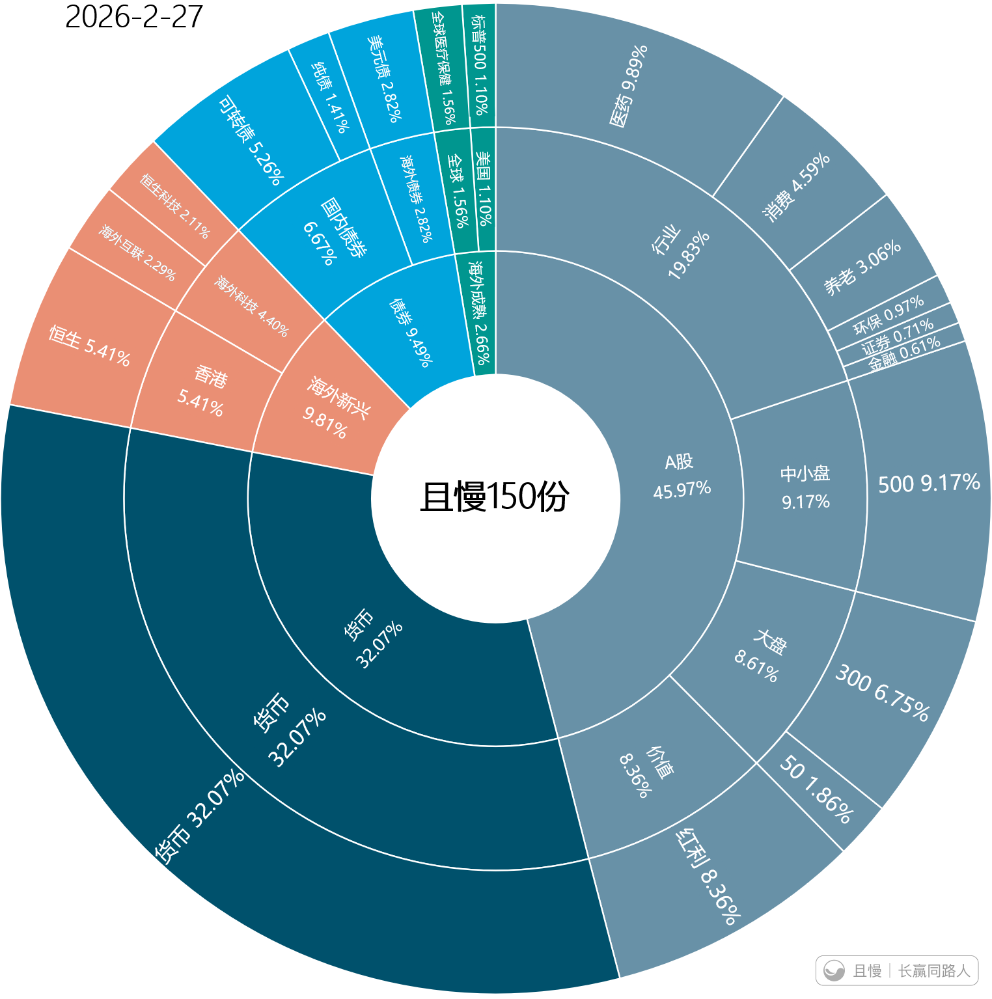
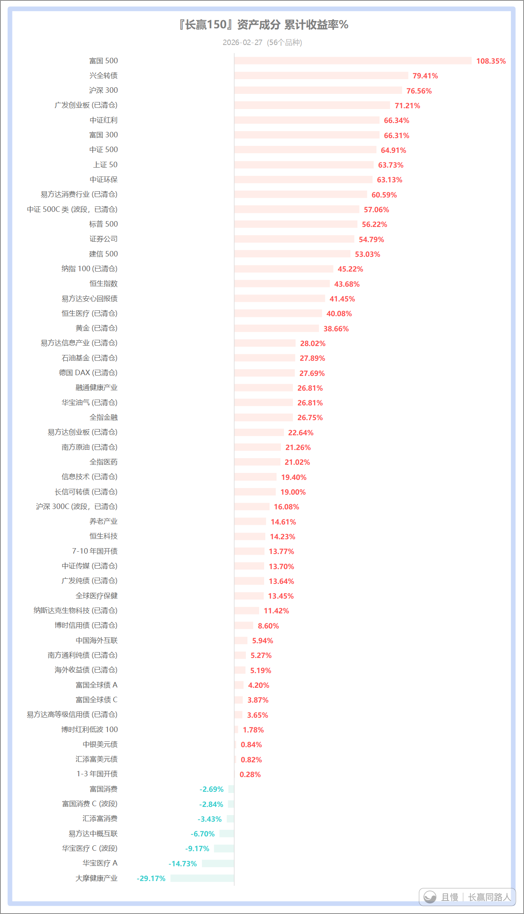
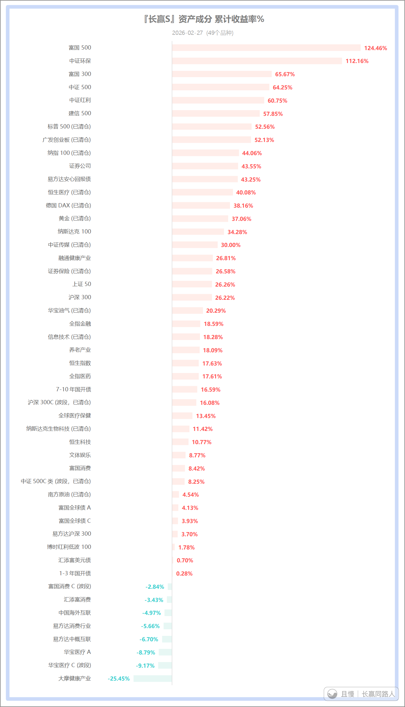
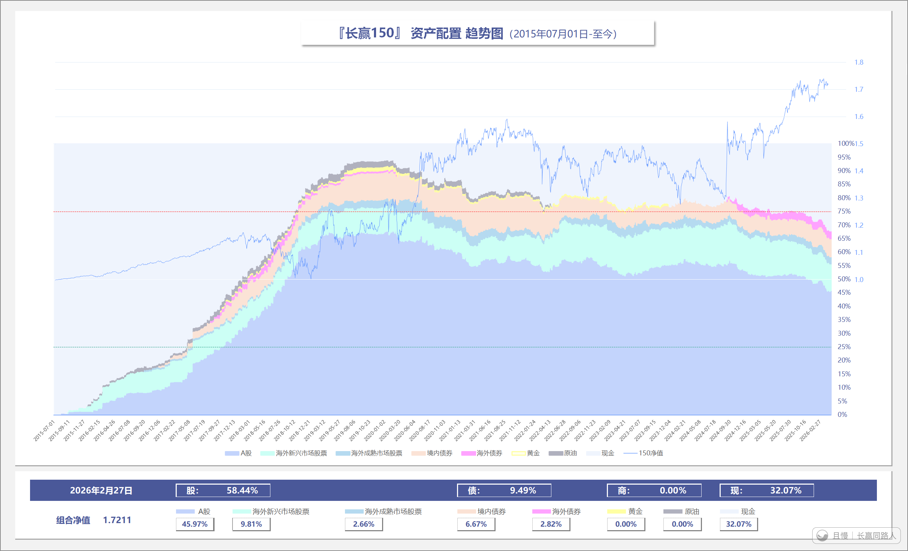

说一下目前的情况，以及未来的应对。

首先，目前150仓位如下图。

由于之前不断整体减仓，目前A股仓位只有不到46%。加上港股也不超过50%。其中还包括8%红利仓位，波动会远低于其它股票品种。

现金仓位已经上升到32%，远超应有的最高限额。这提供了很厚的安全垫。

债券仓位会在目前提供对冲，仓位接近10%。

下一步，将针对波动巨大的品种，加大波段力度。

目前最有可能操作的是恒科/中概。不排除买回最高点清仓的传媒，以及大冤种医药医疗。

风浪越大，鱼越贵。今年起没有小白加入，封印解除，我会加大波段力度，尽量增厚利润，降低成本。

相信我，无论发生什么，即使所有人都要死，我们也会是最后一批倒下的人。

（图二、图三、图四新米制作）

