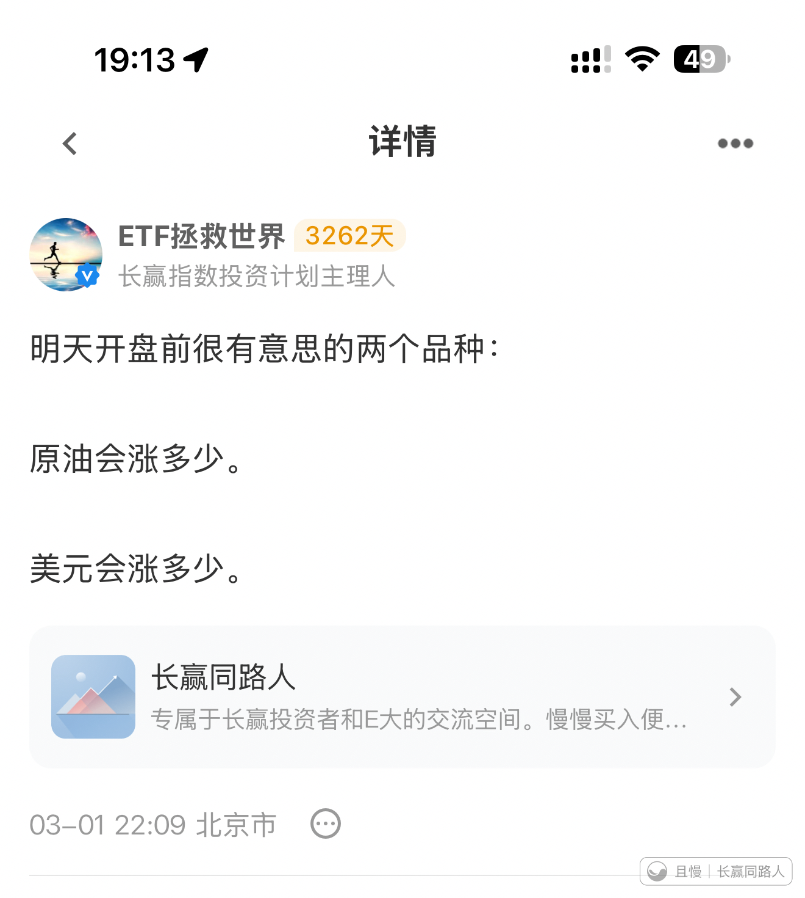
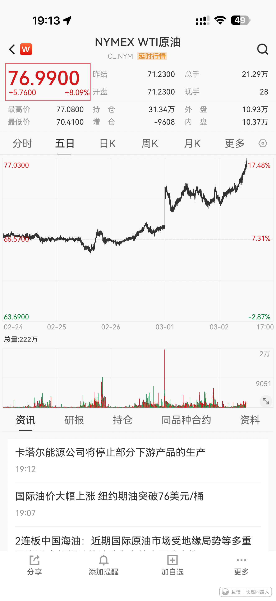
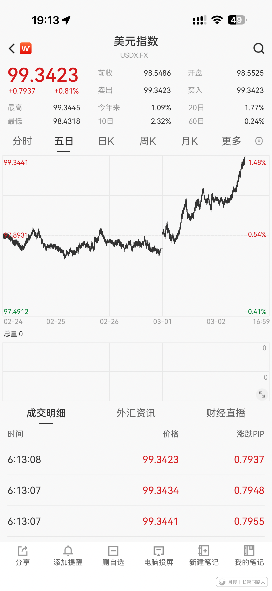
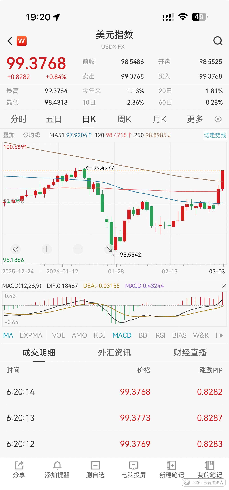

周一开盘前，我有两个关注的问题，一个是美元，一个是油价。

两天时间一个涨了接近20%，一个涨了一个多点。

美元上涨是避险需求大增。油价上涨是霍尔木兹海峡被封锁。

今天买了一份美债。

目前美债有一个风险，就是油价带动美帝通胀上升。但是其它方面看，我认为买一份美债是合理的考虑。

资产全方位，全球配置，正常情况下是绝对正确的。

只是需要祈祷，极端不正常的情况不要出现。

新米练习菌
涨了那么多，3/1说起的，神奇的是2/24正好说了这个：
——
【2026/2/24】【且慢】
我有个朋友今年想出国旅游，准备换点外汇。他问我，哥，你说我在什么价格换比较好啊。
我说，好家伙我哪儿知道啊。RMB汇率走势那是能说清楚的吗，不得看YM的心情啊。
不过我有个办法。比如你年底要出国旅游，比如说你想去大漂亮吧，你需要5万美元。那今年这一年还剩10个月，你不如用类似“定投”的方式把它换了。一个月换5000。
当然，还可以稍微进阶。
比如说，在年线半年线以下的月份，可以多换点。比如换6000。
在关键支撑位，比如6.85-6.88啊，比如6.35-6.4（如果能到）啊这些地方再额外换点。
你这样一套操作下来，既不会因为你一把梭哈但是继续跌你换高了，也不会碰一下支撑位就反弹导致你成本拉高。
我觉得这样比较合适。
朋友说，谢谢哥。
我说，多大点事儿。祝你旅途愉快，注意安全。
——
然后，就两天，到了近期最低点，然后，就后两天，涨了。
没事，只是觉得神奇~ 

新米练习菌
【留言2】另外，关于《美债的笔记》都更新在了这里：
https://qieman.com/content/content-detail?postId=66229
（看走势用的大体画面+所有E大的发言明细+一些相关笔记）
（数据更新到了昨天+发言更新到了今天）

新米练习菌
【留言3】科普用的笔记（1）：
一、NYMEX WTI 原油 🛢️
• NYMEX：纽约商业交易所（New York Mercantile Exchange），是全球最重要的能源期货交易市场之一。
• WTI：西得克萨斯中间基原油（West Texas Intermediate），是美国本土生产的轻质低硫原油，也是全球原油定价的核心基准之一。
• 简单说：NYMEX WTI 原油就是在纽约商业交易所交易的、以美国 WTI 原油为标的的期货合约，它的价格是全球原油市场的 “风向标” 之一。
------
二、美元指数 💵
• 美元指数（USDX）是一个综合指数，用来衡量美元对一篮子主要货币（如欧元、日元、英镑等）的汇率变化。
• 它反映的是美元在国际外汇市场上的整体强弱程度：
o 指数上涨 → 美元相对其他货币走强，全球资金更倾向于持有美元资产。
o 指数下跌 → 美元相对其他货币走弱，资金可能流向其他市场或大宗商品。
------

新米练习菌
【留言4】科普用的笔记（2）：
一般情况，
因为原油等大宗商品大多以美元计价，所以美元指数和油价通常有反向关系：美元强，油价承压；美元弱，油价易涨。
但这次，
美元指数↑：因为地缘冲突引发了全球避险情绪，资金涌入美元寻求安全。
油价↑：是霍尔木兹海峡被封锁，市场担心供应中断。
“目前美债有一个风险，就是油价带动美帝通胀上升。”
可能是这样的：
油价大涨 → 美国通胀上升→ 美联储加息预期 → 美债价格下跌
加息意味着借钱的成本变高，市场上的钱变少了，
美债的价格和市场利率是反向关系，
当市场预期未来利率会上升时，新发行的债券会提供更高的利息。
这会让手里已有的、利息较低的旧债券变得不那么吸引人，大家就会抛售，导致旧债券的价格下跌。
（以上仅为个人理解和笔记）
------
💲【2026/1/21】【且慢小组评论】
Luckyzz：
E大，请有机会的时候再聊聊美元债好吗？现在可以适当加仓吗？
01-21 10:10 山东省
ETF拯救世界 作者：
长债慎重，中短债完全可以慢慢买点。可惜现在都不能大额申购，否则计划会加仓的
01-21 10:15 香港特别行政区 

小学渣
极端情况：地缘黑天鹅 + 通胀失控 + 美联储硬加息 = 全球资产一起杀跌，正常配置逻辑失效。交卷！

Khan
E大，从最新的情况看，给美债最高几个点位？

> 李启航 > Khan
> 现在还是5-8%，我自己有账户，买到 5%就停下来了，境外账户不敢多买，停在5%

