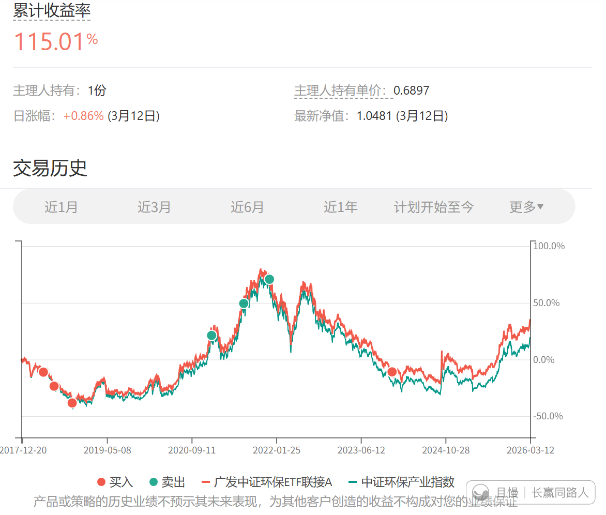

环保也要考虑什么时候第二次清仓了。

曾经挨过多少骂，后来就有多少幸福。

第一次2018年底买完，2021年底清仓。

这次2023年底买，2026年卖出。

事后看，好像没什么了不起。但其实，你好好想想，这些年要经历多少心态起伏，才能做到。

2018年买完，整整2年不涨。甚至还浮亏不少。被人追着骂。

2021年，新能源风起云涌，慢慢卖出继续被嘲笑踏空了。

清仓后一个暴跌，然后大幅反弹，被人追着质问：为什么不买入？

然后轰然坍塌。能忍住一路不买回，谁能想到有多难？

2023年底一片哀嚎。我买，又被人组团来骂，说我是骗子。骗大家买基金。

然后又拿2年多。起起伏伏不为所动。

我真的很喜欢低买高卖。我自己做投资，低买高卖，长期短期，玩得不亦乐乎，无论如何涨跌，0.0001%的心理压力都没有。因为我知道自己做的是正确的事，一定会有好结果。但是跟大家一起做，就要承受巨大的压力。每一步都是如此。

好在大家都赚到钱了。只要不放弃，结局就会是好的。

红魔披头士
我的环保网格总计买入10笔，算上今天的卖出，已经卖出7笔，平均每笔盈利30个点，再卖三笔剩下的就是网格留利润部分了。

红魔披头士
中证环保，23年3月14日，E大发微博说支撑位在2020左右，3月16日跌破支撑收盘2000点。也就是在那一天，我的网格开始建仓买入，我买的是环保ETF，首网价格是1.295，后面单边下跌，总计买入8笔，最后一笔是24年9月的0.81。924行情好转后，卖出两笔，25年又以0.91和0.86接回来了，后面就是单边上涨行情。越涨越卖，现价1.457，我的成本0.778。如果拿我的首网价1.295和最低价0.793相比的话，跌幅接近40%。
长赢是23年双十二买入的，那一天指数收盘1416，后面指数的最低点是24年2月5日的1202，最大浮亏15个点左右，目前浮盈53个点左右。

黄昏骑士 > 红魔披头士
佩服兄弟的操作和计划，一点不同思考，中证环保其实是电力和新能源的混合，弹性极大，完全可以在场内长持加小幅波段，长持会不会收益更大

红魔披头士 > 黄昏骑士
场外长持，场内波段，网格每笔卖出我会保留30%的股数，留利润部分算下来还可以卖5～6笔。环保我的仓位很低，我还持有一个相关度很高的光伏，那个仓位比环保略高一些。这两个加起来，当前占比也就3%左右。

