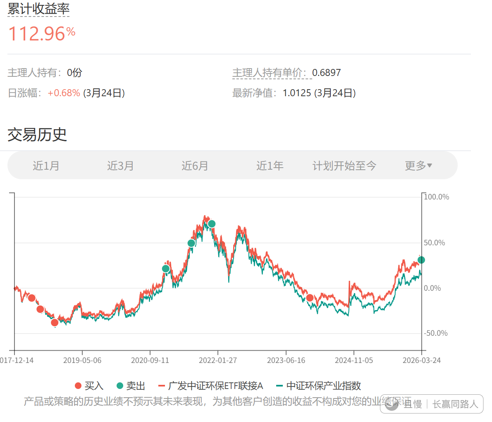
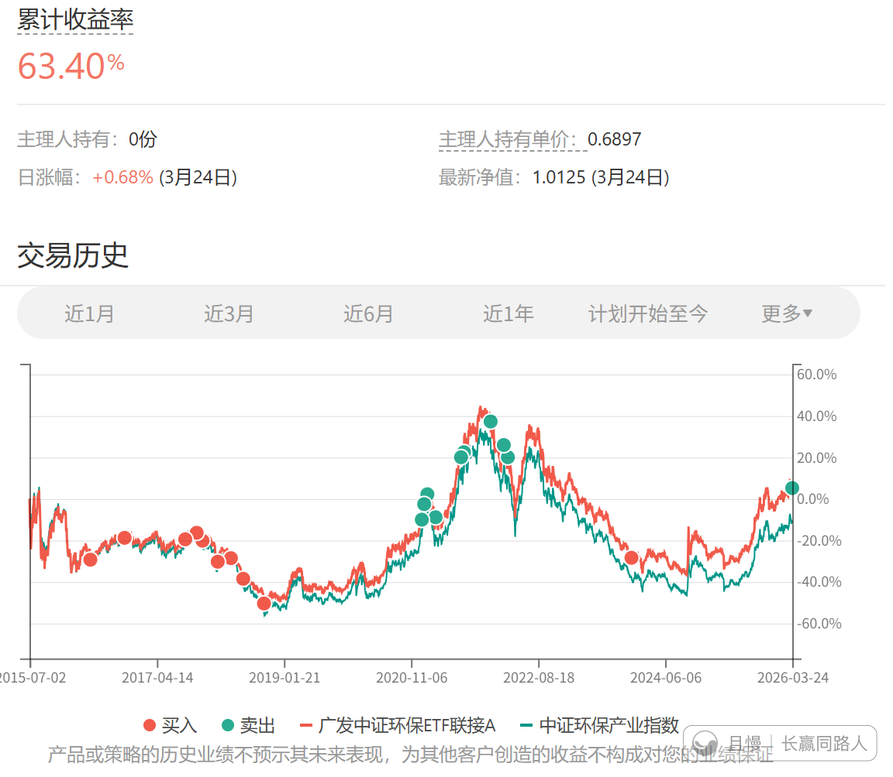

今天卖出的那份环保，所有且慢的朋友，平均收益率只有50%多个点。

比之前动辄70、80%以上的收益率差一些。

不过想想环保/新能源类基金，这些年套了多少人，这两轮加起来几十上百个点的收益率，也算能接受了……

环保这个基金，真的让咱们所有朋友五味杂陈。当初挨了多少骂，最终也算是修得正果。

咖啡不挑豆儿
E大可否解读一下最近买消费，但是选择基金不同，特别是本次又选择了主动基金？
> 红魔披头士
> 消费有很多种，首先得明白E大买的哪个。
> 今天发车的易方达消费，是以内地消费为基准的主动基金，而内地消费这个指数是没有追踪的指数基金的，想买也买不了。
> 再有，拿S计划来说，这次买入时间拉开半年，空间拉开15个点，没有解释的必要了。而150是高抛后的低吸，买入也是理所当然。