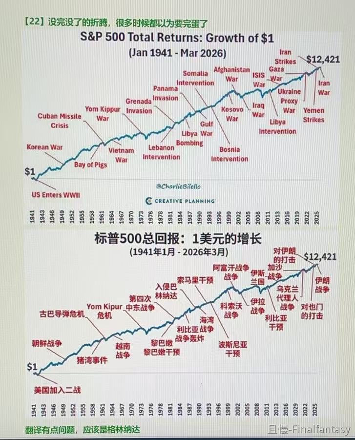

刚才那张图，看评论，很多朋友的想法可不是我想要的反应。

有朋友问，我想表达什么。是看多还是看空了。

我的回答：

我什么都没有想表达。我只是把客观数据贴给你们，每位朋友可以观察、思考，结合历史数据制定自己的交易策略。

有朋友说，看起来好危险，曾经跌过80%，我要清仓了。

我的回答：

跌80%是客观事实，你的持仓，难道是因为你以前不知道所以持有的吗？看起来是这样。那只能说，以前不理性，现在也不理性。

再说一次，我什么都没有想表达，我希望大家结合数据制定自己的交易策略。

其次，历史曾经大跌80%，但也有跌40%、20%，甚至10%就反弹新高的情况。你需要制定的策略，是能够在所有情况都可能发生时，都不是最差的选择。

投资要理性，要收集信息，要分析信息，要制定策略，要执行策略。

当然，不只是投资，几乎所有事情都是如此。可惜，理性的人其实并不多。听风就是雨，道听途说，容易被片面的事实所蛊惑，才是大多数人的状态。各位一定要训练自己，更加理性才好。

Finalfantasy
共勉👍🏻
在有效的市场下跌即是机会，控制仓位和计划，时间是最好的波动修复器，拉长时间来看有效市场都会给出回报

> ETF拯救世界
> 其实这个图一定程度就是片面信息。拉到100年当然是这样，但是在某些特定的10年、20年、30年，会完全不同。而在那10-20年正好投资正好退休要用钱的人，则会是另一种感受。可以这么说，超长期来看，一定是向上。但有可能甚至在10-20年都在原地踏步。这些信息都知道理解了，才能更加理性的制定计划。也才会在黑天鹅发生的时候不至于慌乱做错事。