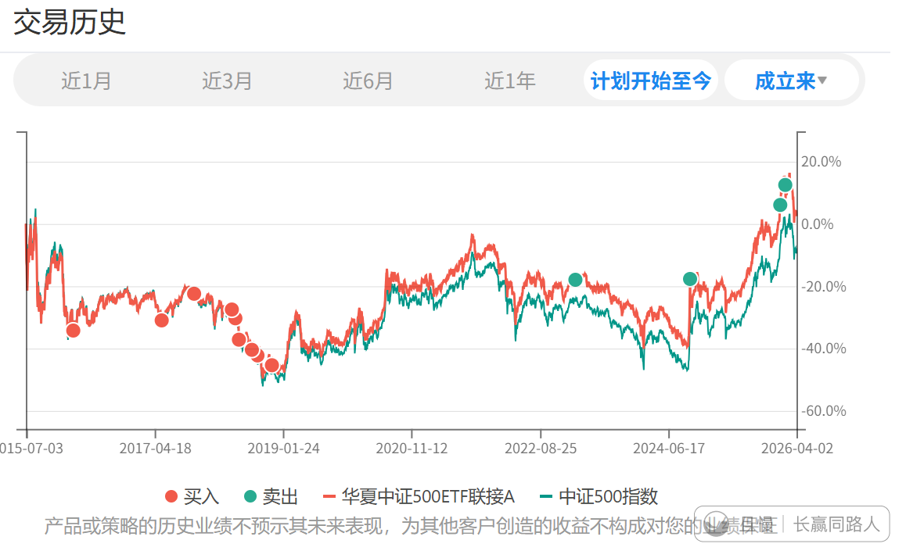
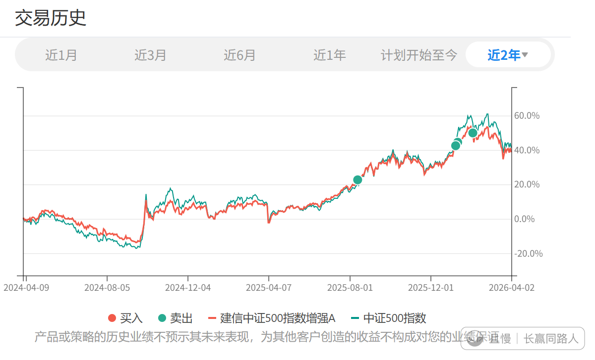
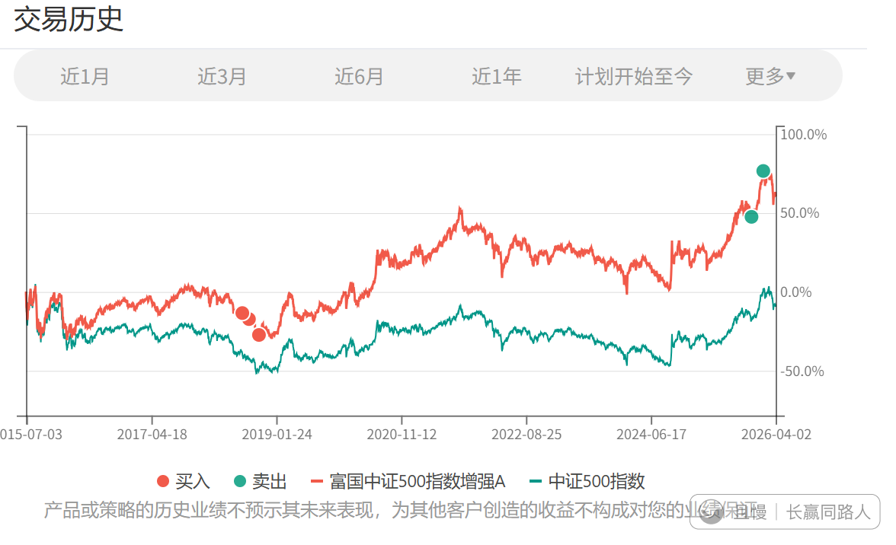
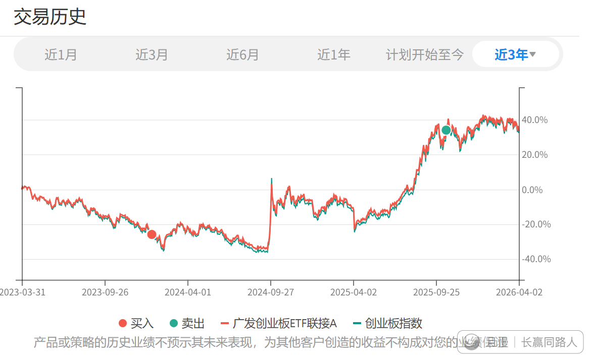
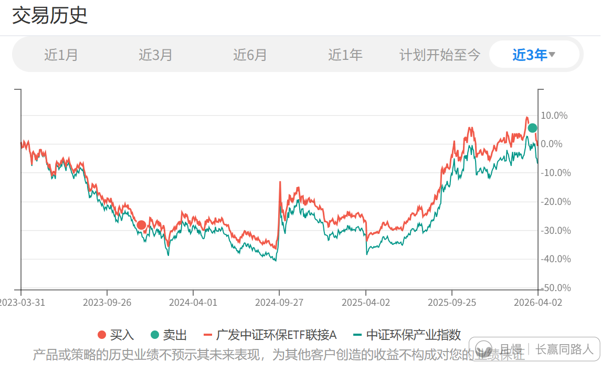
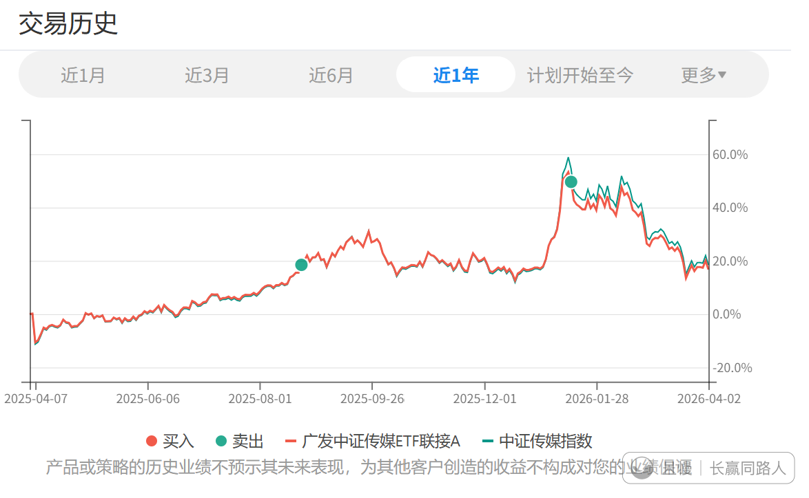
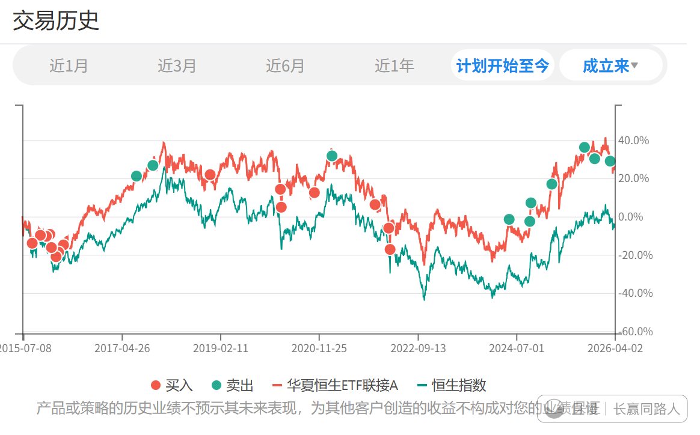

从我个人来说，这一波上帝派来的救生小艇，该上的品种基本都上了，我没有太大遗憾。

环保、传媒、创业、信息，全部清仓。

500大量减仓，恒生适度减仓。

如果说有没有不完美的，其实也有，如果能在合适的减持策略下，再多卖一份50，一份500，以及清仓券商，就会是完美的。最终没有找到最好的时机，也算是小有遗憾。

总而言之，无论未来涨跌，我都能够非常平静的接受。手里收回的大量子弹，也会在关键的时候继续打出去。

