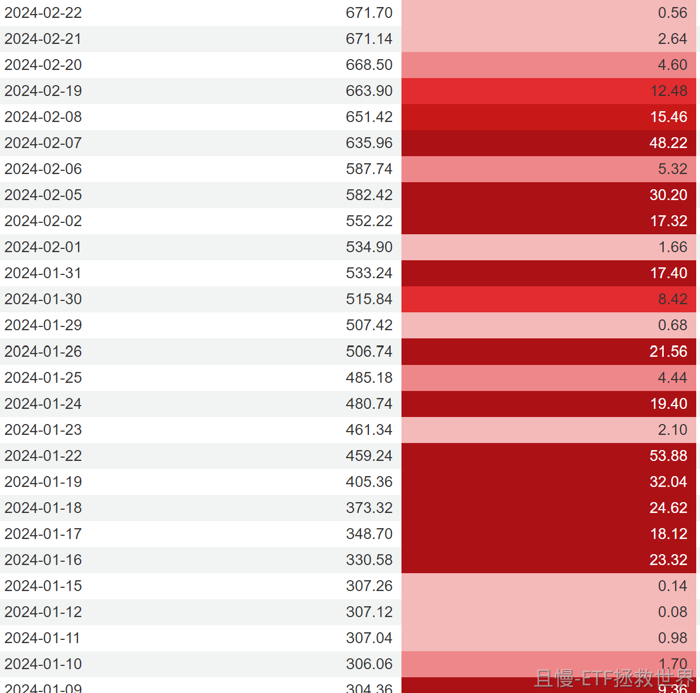

你肯定知道图一是什么。

那你知道图二和图三是什么吗。

我曾经讲过无数次2012年和2015年的故事，在2024年和2026年又发生了。

ETF拯救世界
汇金的特点，在底部，顶部区域大量交易。买和卖都非常果断。当然，这与它的资金性质有关。它不需要长期在市场里，只在关键的时间出现即可。还有，它也没有“踏空”的焦虑。但是无论如何，汇金的买卖点，都极具参考价值。估值+技术+汇金，可以95%确定顶底区域。

> 每天都要开心呀 > ETF拯救世界
> 老大，前段时间跌到3800汇金抄底买了吗？

> ETF拯救世界 > 每天都要开心呀
> 汇金是做大波段的。这样的小波动他们不会动。

> ETF拯救世界
> 但是1月他们卖出这么多300我不理解。300不贵，技术也没有到高位，为什么巨量减持。只能说是因为2024年买太多300了，没有太多500这样更高估的品种卖？

ETF拯救世界
在A股做投资。我不觉得任何人真的NB。除了汇金。

> 骨头卿
> 老大呀，15年7月之后到24年8月之间，HJ就没出过手吗？

> ETF拯救世界 > 骨头卿
> 

ETF拯救世界
我没有抄，是我先卖的。当然，依然没有人家卖的好。

红魔披头士
终于查到了，这两个图是中证500ETF和沪深300ETF的规模变化，豆包查了半天没查出来，千问直接给出了答案。当时国家队大规模减持，大家都是心知肚明的，那会儿都说上面想慢牛不想疯牛，谁晓得后面一蹶不振了。