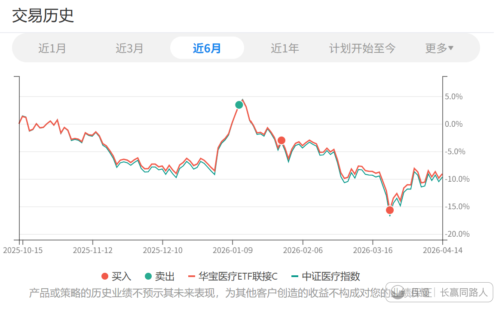

今天这一车卖出医疗C，是3月23调整最低点那天买入的。15个交易日，8%左右收益。

不能说好。因为我的预期是10%。但是8%也能接受。

接下来这个品种就进入了涨跌都舒服的状态。

跌，我们继续买回来，继续吃波段。如果一年有3-5次这样的波段，即使年底医药不涨，整个大类的收益率也会提高不少。

涨也没事。还有大量持仓。

其实这样的状态这两年一直都应该存在。只是之前大家都懂，小白不停涌入给哥喷麻了。

之后不会了。

S买入这一份红利100则简单很多。距离上次已经有4个月，时间拉的足够长，所以继续买入建仓。

落_ > ETF拯救世界
E大你是不是忘了这个了
😇 互联
交银施罗德中证海外中国互联网指数(QDII-LOF)A (164906)

> ETF拯救世界 > 落_
> 这个和易方达中概和恒生科技你要把它们三个当成一个品种来看。放心不会忘的。合适的时候会操作。

王大壮
能不能讲一下为什么红利低波100比中证红利好呀？

> ETF拯救世界
> 未来也会买中证红利。只是现在仓位有了就先买100。看后续操作吧。