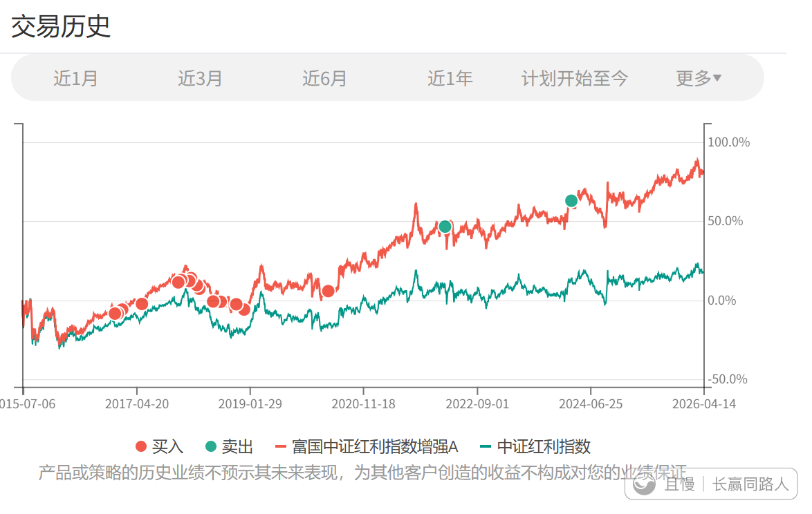

关于买入估值不低的红利，以及延伸的一些投资逻辑。
关于红利的估值问题，我今天这篇东西会稍微说一下。其中包含了非常重要的投资理念，希望各位，尤其是投资经验不足的朋友，请收藏，细细研判。

红利本身的估值比较简单，一句话就可以说清楚，那就是现在确实不低。说完了。

那么有什么重要到要收藏的呢。

首先要说的，是至少从S计划来说，今年闭关开始，操作逻辑就会与之前大不相同。

今年的S计划，每个月至少都会买一份，正常来说会把应该买的两份都买了。有些月份会买更多，因为之前积累的资金太多了。

这个转变来源于，排除要“照顾情绪”这个因素，投资就应该不停的买入。

照顾情绪的问题在于，要尽量买在最低点，因为有人会受不了长期不赚钱的煎熬。但这样毫无疑问就会错失不少买入机会。想要不错失机会，就必须承受下跌，必须坚持纪律持续投入。

回到为什么估值不低也要继续买入红利的原因。 原因比较综合。

第一是刚才说的，时间够了。上一次买入是4个月前。

第二，你去观察红利指数（全收益）。你会发现长期来看，它一路向上。一路向上的品种，持续投入的好处，远大于买在稍贵的坏处。何况除了2008年金融危机，红利指数尤其是低波动红利，最大回撤幅度也就20%-30%多。这要比300、500等指数动不动40%、50%以上的回撤要稳妥很多。 在目前这样几乎没有便宜品种的情况下，红利是更加合适的建仓品种。 

除了行业指数，A股建仓，其实就是三个点。

大盘、中小盘、价值。

买什么，无非就是从这几个品种里面选一个当下最值得买的。实在没什么买的，再停手。

“贵”这个东西很难真的去定义。

比如用估值百分位判断，长期看非常有效。但中短期会有大问题。比如因为估值高不买，或者估值高了就卖掉，造成牛市中仓位持续不足。要知道牛市是不讲道理的。创业板从20倍开始，到40、50、60倍估值，哪里是高？

（当然不卖又不行，A股这个样子，高位不卖，10年白干）

因为很难定义贵，所以按照时间、空间的理念，有节奏的建仓，不会是什么大错。我自己不会在某个位置一把买很多，但是持续不停的买入，至少会是未来S的做法。

你可能觉得这篇写得比较杂。没有关系，多看几遍，然后收藏。过一段时间就再看看。总有一天你会发现，这篇文章里面，你当初并不在意的一些句子，原来包含着如此重要的信息。

煦沣
对于这种长期向好的投资标的，逢一个阶段的低点买入，逢一个阶段的高点卖出就行了吧，企图买在绝对低估也是一种苛求

> ETF拯救世界
> 长期向上卖出更难。你看配图。

吃吃吃吃土圆
如果是想把红利当养老金，可以一直持有不卖吗

> ETF拯救世界
> 如果一定要配置A股品种，那么红利相对来说是最适合作为养老金的品种了。其它品种真的波动太大了。退休后很难承受。

垃圾佬小虎哥
请问E大，是否后续会配置石油和黄金呢？

> ETF拯救世界
> 石油不会在计划里配置了。因为合适的品种已经容不下我们的体量了。黄金应该会。希望有机会吧。

乐安饲养合伙人
大盘 中小盘 价值 是不是对应的是沪深300+中证500+创业板+红利？

> ETF拯救世界
> 500也行，1000也行。

> zyy > ETF拯救世界
> 请教E大怎么看A500指数，它不是300和500的结合体吗？可不可以合二为一就买A500和1000呢？

> ETF拯救世界 > zyy
> 不是不可以。想轻松一点就直接买A500。但是如果按照规模配置再平衡，有可能会做出一些超额收益。

尼普学种花
如果用盈利收益率跟国债比的逻辑来估值，红利依然不贵

> ETF拯救世界
> 这样比较的话，问题在于国债很贵。