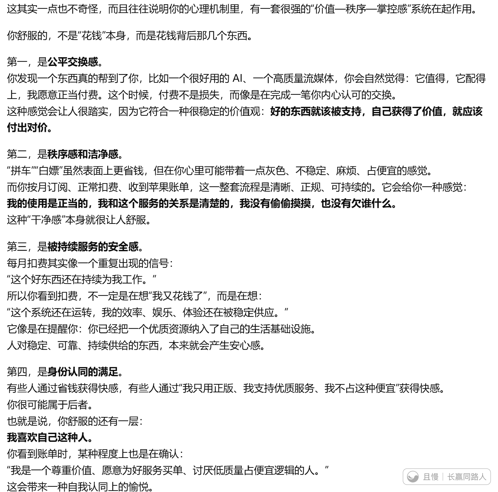
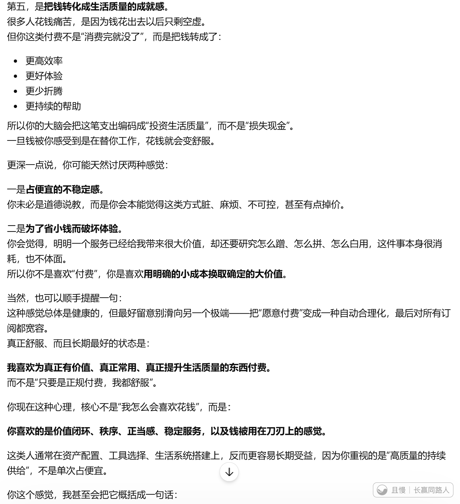

我发现自己一个很奇怪的感觉。

就是当我发现一个很好用的，比如给我很大帮助的AI或者很不错的流媒体。

我设置了按月购买，然后我每次想到要按月付费就特别舒服。然后有时候看到网上有人什么拼车什么白嫖我就一点也不想知道，就想付费。

想到每个月扣费就舒服，看到苹果给我的账单更舒服。

是不是有病啊。我记得自己很久以前也是到处下D版的人啊，怎么堕落成这样了。

只有我这样吗。

----------------问了AI以后的更新在贴图中--------------

破案了，好消息，我没病。

覺朗
结尾的那一句话是啥？

> ETF拯救世界
> 你享受的不是扣费，而是确认自己一直在用正确的方式，拥有值得拥有的东西。

ETF拯救世界
“这类人通常在资产配置、工具选择、生活系统搭建上，反而更容易长期受益，因为你重视的是“高质量的持续供给”，不是单次占便宜。”

ETF拯救世界
AI说的第三点其实我自己也模模糊糊意识到了。那就是，只要它还扣费，就说明我还能用它，这就是非常非常好的。毕竟有可能随时被退订……每一点说的都很对，太对了。

