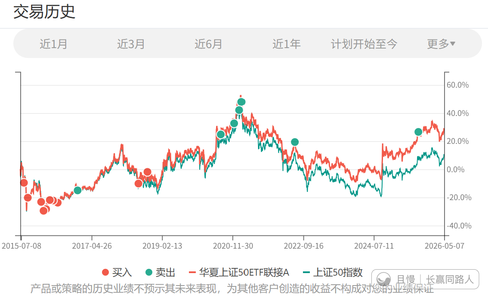

今天150继续减持一份上证50。

这个指数基金是中国资本市场诞生非常早的一支基金。从它一上市我就不断的交易。一直到这一轮的计划，也在2016和2018两个低位区域作为大盘股配置了一部分。

2020年高位减持了一部分，这次行情起来也在继续减持。等到有一天卖完了，大概率以后也不会买了。

因为这些年市场上出现了很多新的、更好的品种。在我这里，上证50的使命已经完成了。

2024年某些神秘资金对它也是大举增持。1月份他们走了，差不多的位置咱们也走一点吧。听大哥的话，跟大哥走，不会错太多。

ETF拯救世界
大哥没有说什么，但大哥做的已经告诉你很多。你可以不相信大哥说的话，但大哥做什么你一定要重视。

