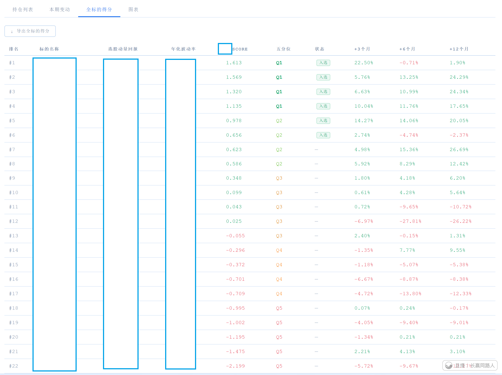

最近一段时间一直在思考、研究、实践将动量因子融入整个投资体系。

因为我，以及整个投资计划现在面临到一个问题：

“价值投资”与时间，以及公开计划的多重矛盾。

如果是自己做投资，持有一部分不涨的仓位，问题不是很大。但面对人数众多，且进入时间不一，仓位不一的人群，时间就是一个极其重要的因素。

价值投资终将赚钱，不死品种越跌越买也一定不错。但是时间的问题，有时候对于有些人来说是个大问题。

更何况，把真正有用的东西融入投资体系，对于投资体系的升级完善本身也有很大的作用。

未来，在原有框架（绝大多数品种都赚钱，所有品种极大概率都赚钱的不死品种价值投资）下，巧妙的融入部分动量投资理念，更好的提高资金利用率，更少的等待，是下一步要继续升级完善的工作。

更加具体的周末可以聊一聊。

遇到问题——学习进化——将有用的东西融入，变得更强。这就是我的投资以及人生理念。

ETF拯救世界
我个人认为，个人投资者在股市第一步要解决的是“赚钱不赚钱”的问题。低位买不死品种，可以解决这个问题。第二步要解决的是，在赚钱的基础上，能够更快一些，更多一些赚钱的问题。这个问题要比上一个问题难几倍。当然，大多数A股散户其实连第一个问题都解决不了。无论如何，这个投资计划面对第二步的一些问题，是时候要解决了。

