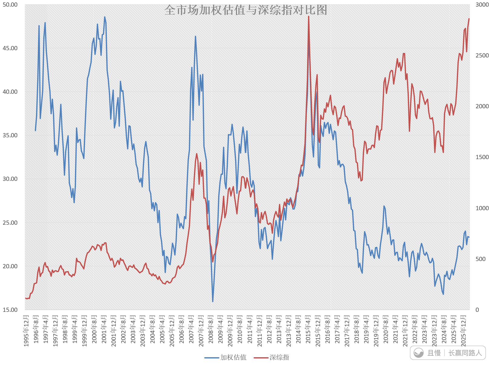
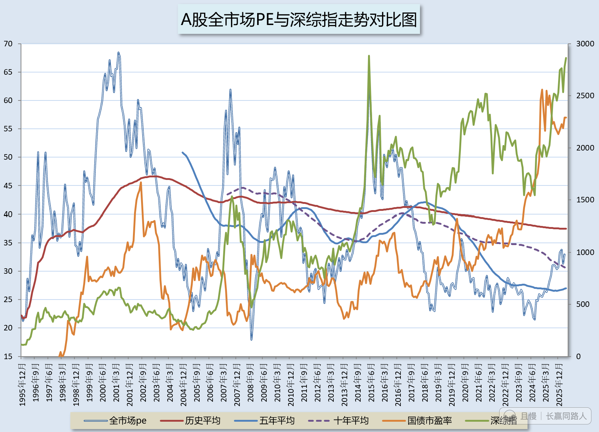
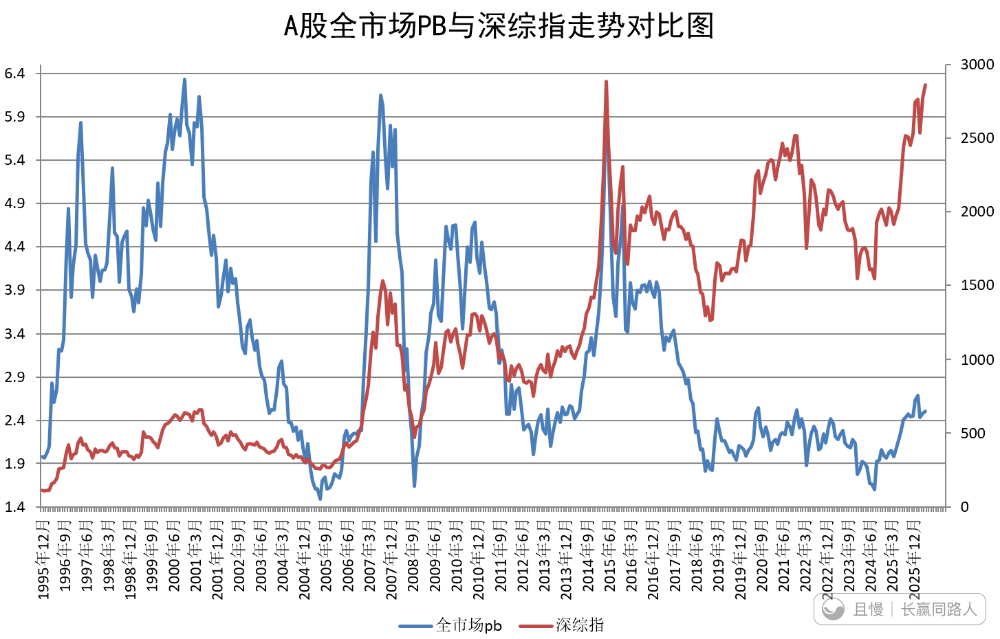
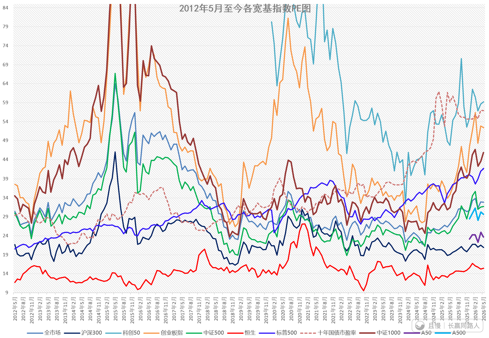
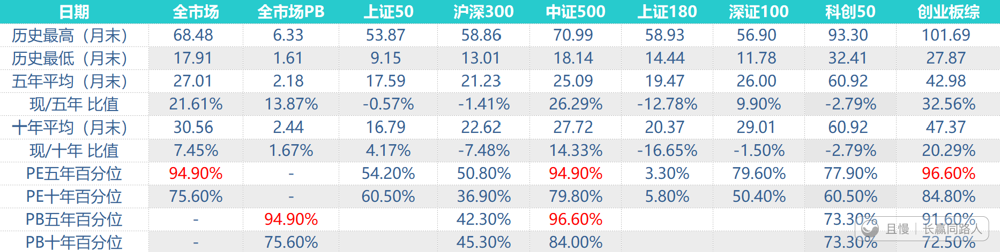
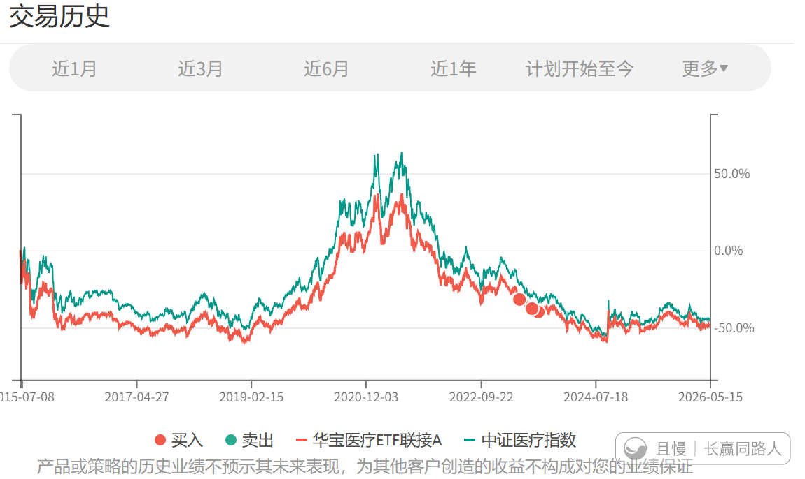
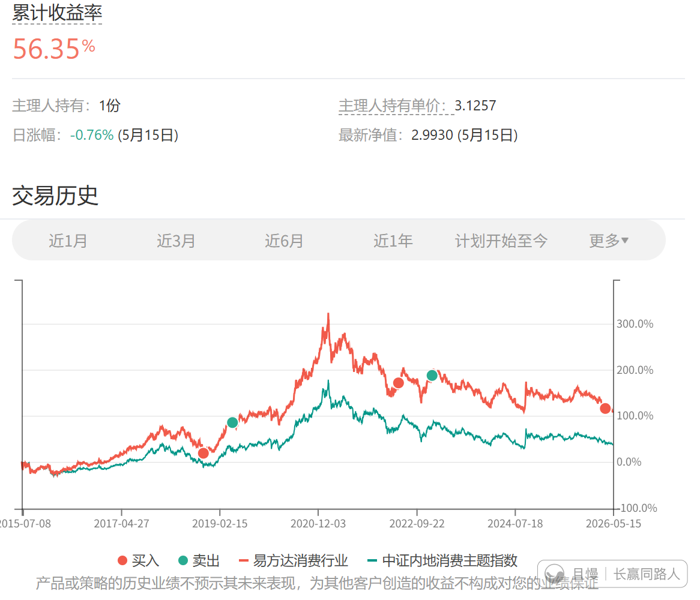
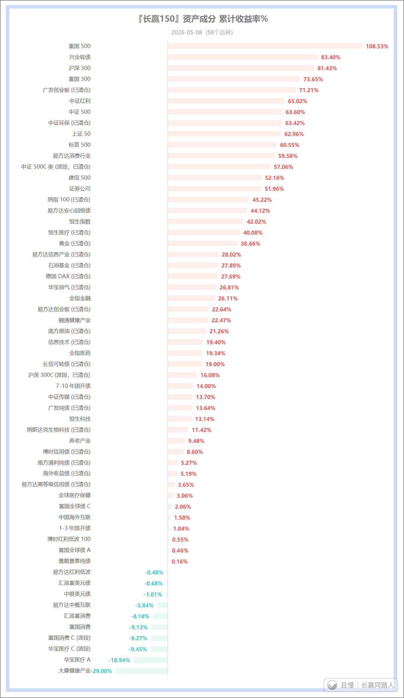
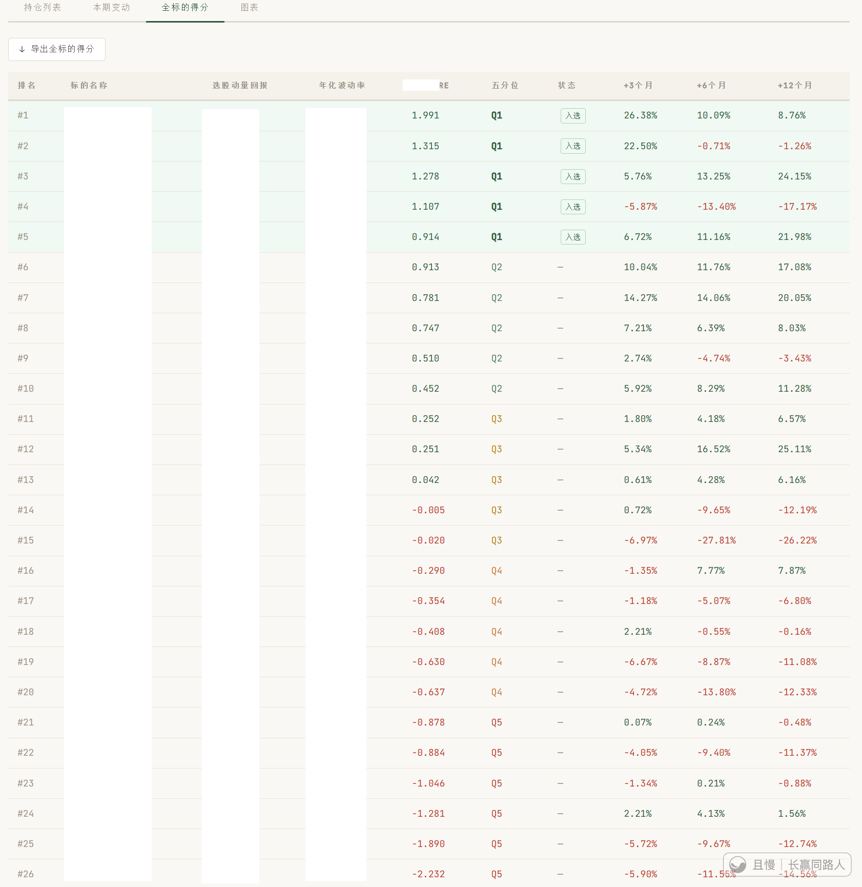
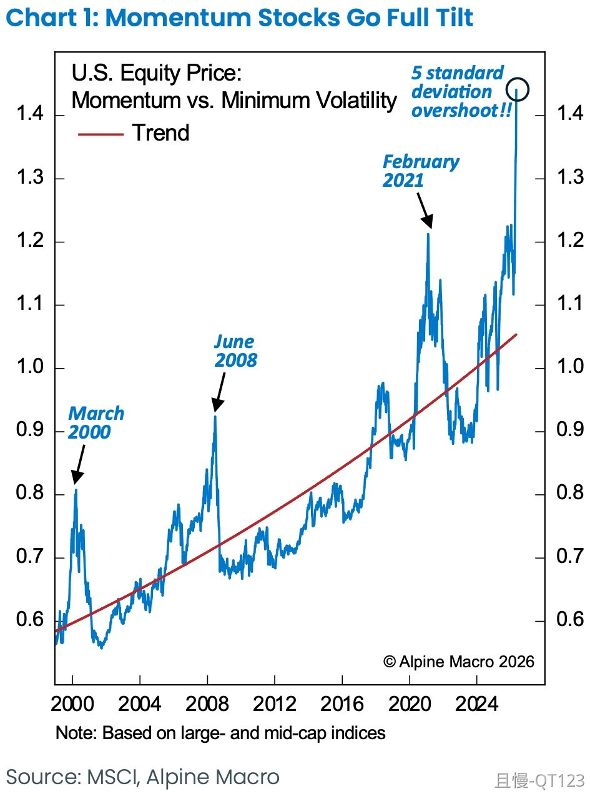

# 长赢小组投资笔记-0003

> ## Excerpt
> 且慢是珠海盈米基金销售有限公司旗下，专注于向个人提供简单、省心的公募基金投资方案的服务平台。

---
各位周末好。

首先当然是A股全市场外部数据加权、等权PE，全市场PB，以及各宽基指数的估值图：

大家可以注意到，宽基估值图比之前的清新了不少。是因为减少了一些品种，显得没那么拥挤了。

减少的是上证180、深证100（这两个都是上一轮计划的主力品种，一直在估值图中没有去掉。）、德国DAX和日经225。

增加了A50和A500。

具体百分比分位是：

不细说，有兴趣的朋友可以仔细研判。

\-------------------------------------------

今天想重点说说，我准备将动量因子融入长赢计划的事情。

长期以来我们的计划，以及我个人的投资，基本上是围绕几个基本点展开：

第一，以价值投资以及指数估值为核心进行长期持仓部分的交易。

第二，在价值的基础上，以市场技术面的压力、支撑位作为具体的交易位置。

第三，在市场波动没有涨跌的情况下，用网格波段操作，结合价值、技术，达到摊薄成本、增厚利润、获取收益的目的。

整套系统，绝大部分框架全部来自于数据以及走势，基本不进行主观判断（理想的情况下）。

这一套系统运行十几年来，没有太大的问题。理由是无论是各位场内还是场外的账户，只要是三五年以上的，必然都是赚钱的。在这个市场，赚钱已经很难，而一个六位数的群体只要严格执行几乎所有人都赚钱，就足以说明系统没有大问题。

但是，

没有大问题，就没有问题了吗。当然有。

首先说买入。大家看这张图。

从价值上看，我们买入的时候它已经跌入可投资区域，从技术上看，当时是有十年以上周期的支撑位。还有，我们绝对没有追高，我们在它从最高点跌了50%多才买入。这不是低买，还有什么是低买。

结果，现在依然浮亏20%。

这是买入的问题。再看卖出。

2018年钻石坑极限买入，6个月后赚了60%卖出。当时看起来很好了。但你永远不知道人类的疯狂可以到什么地步。卖掉之后，又涨了100%。（当然后来追入的所有人只要没走全套了，套了6年了）

所以根据价值去做投资，赚钱的概率非常大，不信你看：

但是，买入太早，卖出太早，就会是最大的问题。

这就是价值与时间的错配。如果你重仓全仓买入太早卖出太早的品种，就会更痛苦。

这个“太早”，其时间跨度甚至可能是数年甚至10年。

两三年前意识到这个问题后，我在自己未公开的投资仓位上开始进行动量因子的实验。这两年整体效果不错，也解决了一些与原来的投资框架融合的问题。今年准备全面注入长赢计划，作为原有体系的补充和升级。

什么是动量。

说白了，就是“追涨杀跌”。可能有些价值投资原教旨主义者看到这个已经在冷笑了。但我一向以来的观点，就是无论一个东西是否符合我原来的理念，只要理论和实践都证明它有用，我就把它拿进来。

而动量因子，恰恰是经过学术研究，证明其在金融投资领域是不多的有效因子之一（还有价值和质量）。

动量投资的理论，就是如果一个品种很强，那么在接下来的3-12个月内，它依然大概率会很强，直到趋势结束。

当然了，追涨杀跌和追涨杀跌也是不一样的。有些人追涨杀跌是全凭情绪追逐强势股，有些追涨杀跌是用数据、模型来进行选择。

（表格中得分高的品种，3、6、12个月后走势，普遍高于得分低的同期走势。分数是按照之前走势打出）

未来计划的几个变化。

首先，会区别品种。比如红利类品种，依然会在下跌中买入。因为它的价格越低，能够拿到的成分股股息率越高，没有理由不买。当然，依然会结合技术面买入。

但是有些品种除了下跌过程中严格执行的网格波段交易，其它大部分长线仓位会在趋势走好后才买。这样当然有可能不再出现以前经常有的买在最低位，但整体看，持有那些“垃圾”品种的时间会大大缩短。

这意味着这些品种的交易放弃了“抄底”思维。

其次，一定是结合原有框架。也就是说，如果一个品种趋势走好，但估值已经很贵，我是不可能买的。

第三，也许最受益的一个环节，是卖出环节。如果一个品种动量还在，趋势向上，未来因为它稍贵就早早下车的情况，应该会少很多。尤其是对一些无法估值的品种，比如黄金。

关于动量投资，基本就是这样。以后如果大家看到一些与以前不同的操作，有时候甚至会不合常理，请体谅。

其实我之所以公布这个计划，最终的目的绝对不是让你来跟我的车赚点钱。而是希望通过这个计划，让每一位朋友知道，一个普通人通过执行一些机械的、制定好的交易计划就能不断获利。有一天你能够制定更加适合自己的计划然后严格的执行它，那我的目的就真的达到了。

投资合伙人
按照动量因子的话，现在医疗消费恒科是不是该割肉？

> ETF拯救世界
> 你说的是完全按照这个交易，我说的是融合进体系。

> 田老师 > 凡潇
> 他有几层规则考虑的，动量趋势坏了，但你估值不高，为啥要卖，当然是继续持有

> ETF拯救世界 > 田老师
> 你真挺厉害。一下子就理解了我一些思路的细节。

Khan
动量有没有可能解决第四个问题，就是不会完全miss掉一些结构性牛市的机会，能在动量起来且估值没有那么贵的时候，蹭一点油水？

> ETF拯救世界
> 如果品种在我一直跟踪的范围内，当然会。如果品种没有一直跟踪，那就没办法了。如果你用这个系统选出100支没有跟踪过的股票也可以，但是那种投资方式不是个人能玩的。

Lina_INverse
我理解，从左侧买入变成右侧了么？持仓体验会好很多，但是我们一车应该也算是比较大的资金了，大资金左侧买还是右侧买更好些呢？

> ETF拯救世界
> 不是“变成”。而是在某些品种上在原有的框架内融入动量的思路。

闲看云卷云舒
E大高产，看了一遍没看懂，再认真学习！动量因子是不是放大版的网格策略呀？

> ETF拯救世界
> 不是。网格的本质是定好了买入和卖出的位置，就吃这一段。动量是只要趋势不坏就持有，直到变坏。这是两回事。

E起富起来
自己的疑问就是在得分高的第4位，为什么在3、6、12月后是负的越来越多呢，难道这个表不仅筛出的是后续趋势涨得好的，也有不好的排位在这里面吗（纯属自己瞎想的）

> ETF拯救世界
> 因为这个不可能100%准确。有时候这个月分数高，但正好是变盘的时候。做投资不可能有100%的事情。主要看概率

招财进宝富贵元元
请问E大，这里说用类似的多因子系统选100支没跟踪过的股票不是个人能玩的，想了解下这个结论的原因是什么呢？ 是因为计算量过大还是什么呢？

> ETF拯救世界
> 主要是交易的问题。你能不能买一百只股票，按照权重配置好呢。这需要极大的资金量和交易系统支持

QT123
动量股相对低波股已经到了+5倍标准差的历史最高点

> ETF拯救世界
> 现在美股很多指标都非常极端。但谁也不敢轻易做空。