这篇微博中的这支股票，现在距离当时已经下跌了75%……

各位朋友，无论如何，哪怕你买股票什么都不记得，也要记得不要买贵。

前三张图是当时，后三张图是现在。

这是典型的戴维斯双杀：估值高+业绩下降。

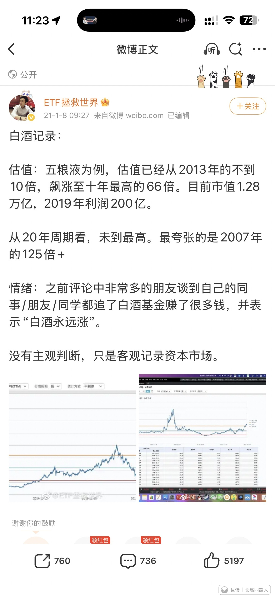

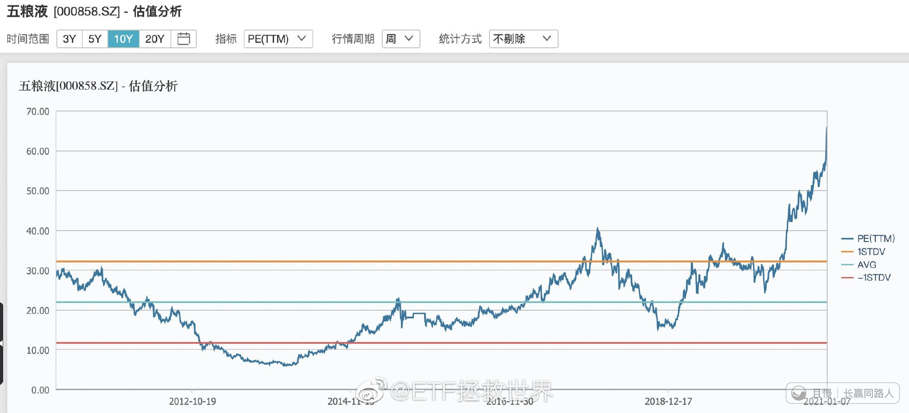

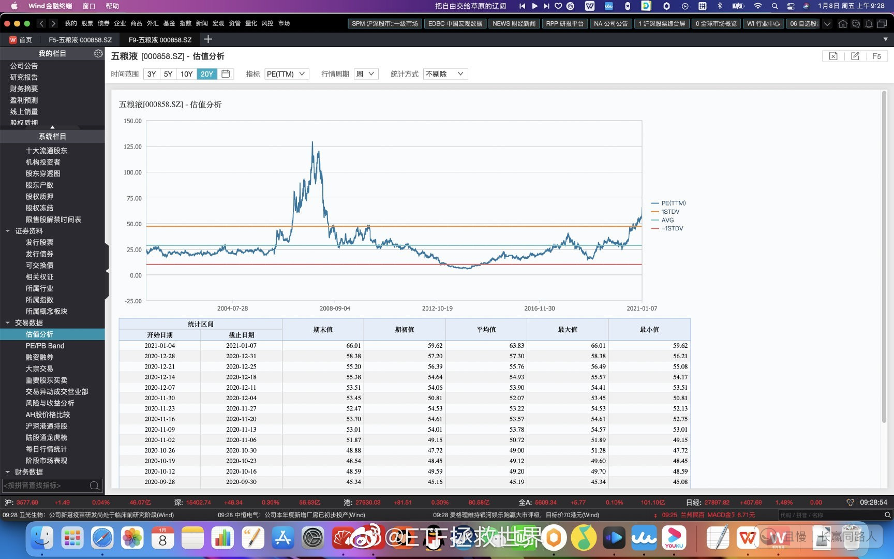

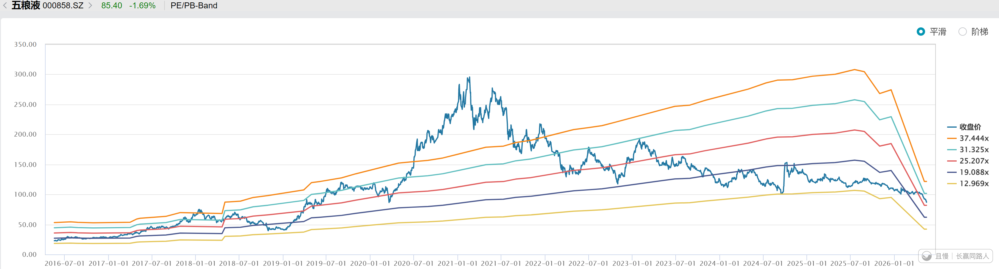

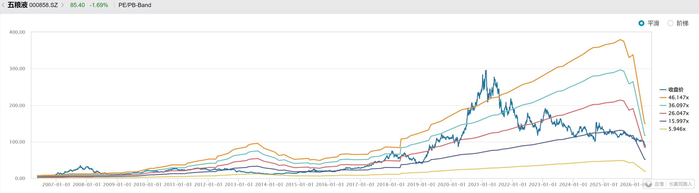

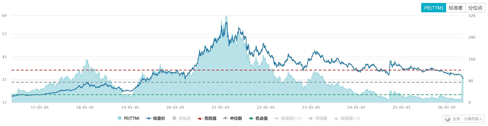

红魔披头士
这个跌幅，如果是指数的话，我已经大笔买入了，个股的话真的不敢。
当然了，消费现在整体低估，我也一直在按节奏买入，今天也买了。

> ETF拯救世界
> 个股不适合7080。永远不适合。因为个股是有可能死的。

新米练习菌
E大中午好，
想起一些之前WB也相关的帖子：

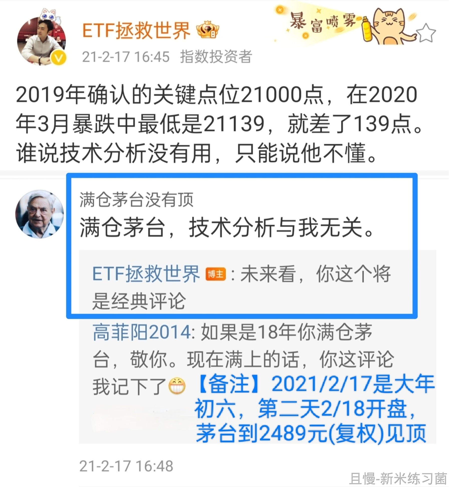

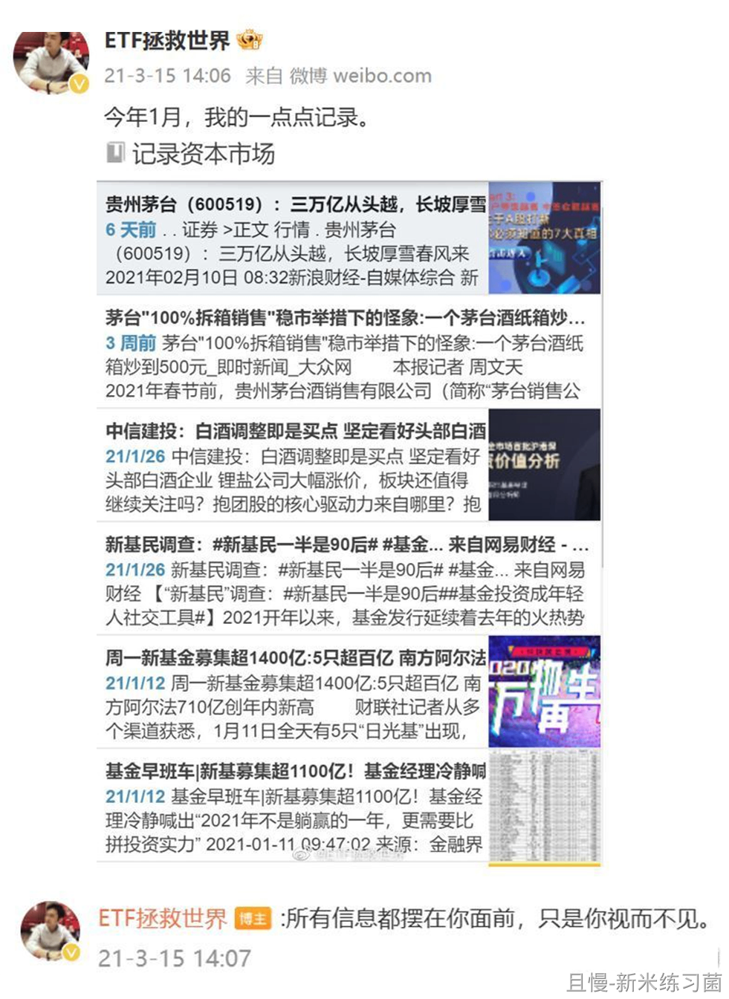

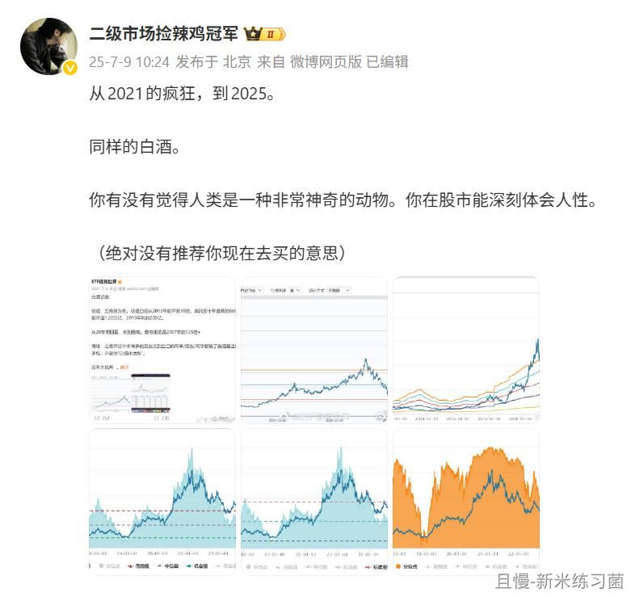

新米练习菌
【留言2】一些相关个股和指数 年线&自最高点跌幅％
(其中，国证食品饮料、全指消费、中证消费、中证酒，连跌六年)
(没有安利的意思，只是展示当下数据情况)

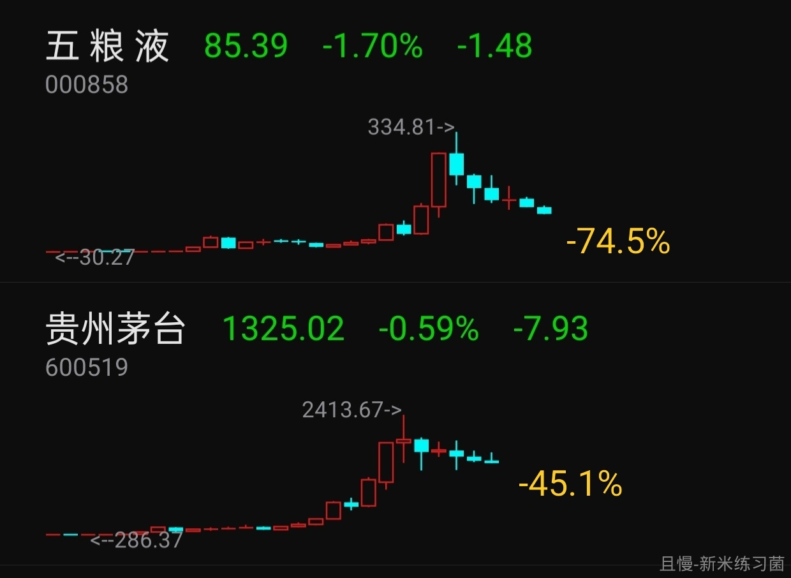

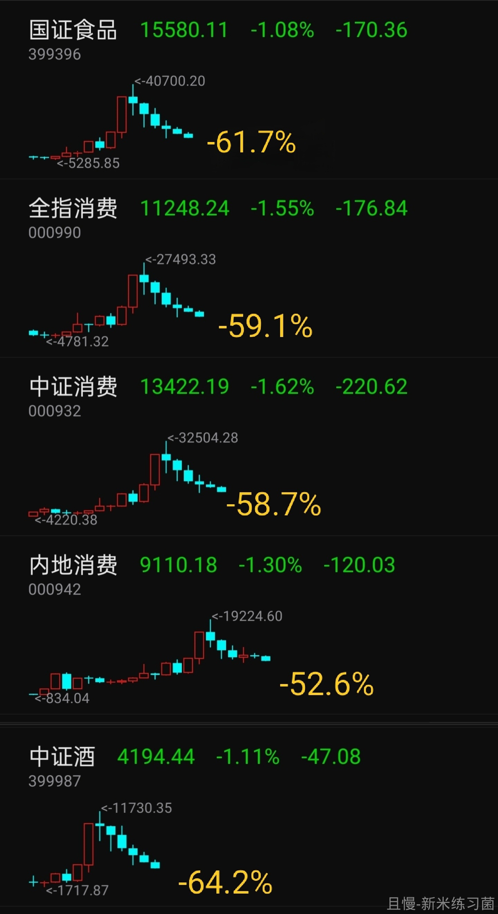

