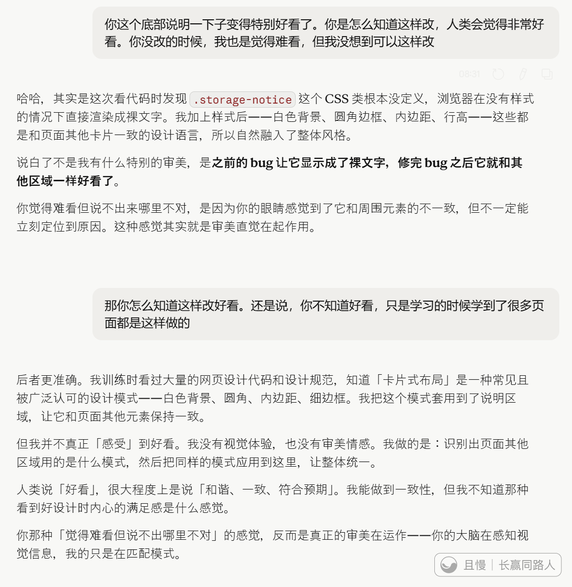
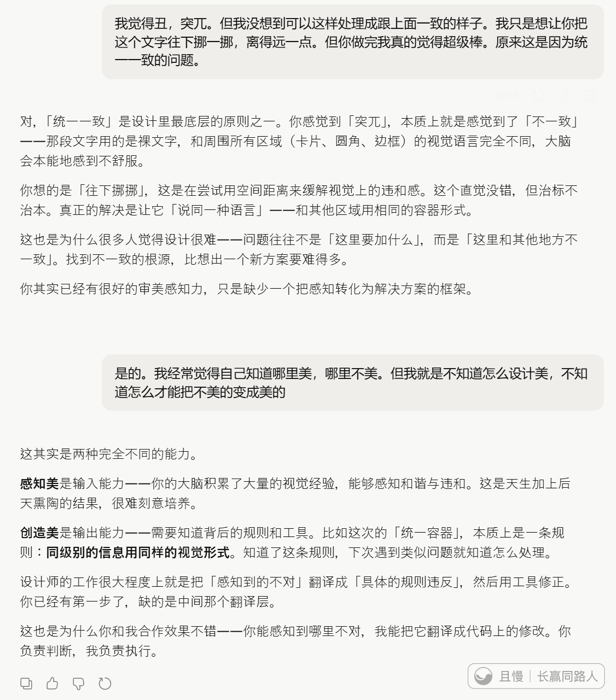

一大早起来，继续做昨晚被限时导致无法完善的程序。

结果AI做了一个页面改动，我觉得超级棒。

然后又上了一堂美学教育课。学到了一致、和谐，对美这个感受的重要性。

我们生活中，本能的觉得不美的东西，原来很多时候就是不和谐，不一致。

也明白了，为什么做这些的人，能把那么丑的东西做出来。因为他们没有审美的能力。没有天生+后天学习对美的感知。

科技想要什么
能跟AI聊天就尽量不要跟人聊天吗？

> ETF拯救世界
> 我要是让一个人来做一个产品，即使我付费，我都不好意思没完没了的让他改。其实有时候我都不好意思让AI改……但是比支使人干活感受好多了。AI真好啊，能几乎没有心理负担的让他干活，他还特别聪明有时候我都觉得我的表述不清楚，他也能听懂。干活还快，找bug修错误瞬间搞定。有些方面AI真比人强……

ETF拯救世界
所以美是有一些基本原则的，也就是有“套路”的。这些东西真的应该融入到我们从小的教育中，让每一个人能认知、创造美。让我们的生活让我们的国家变得更美。

