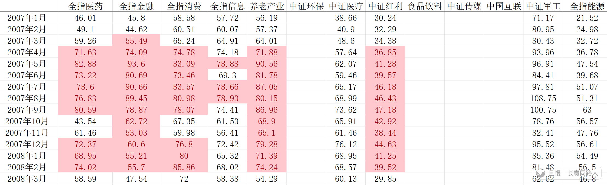
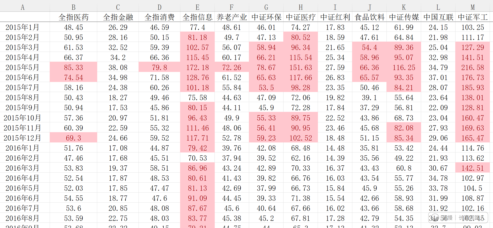
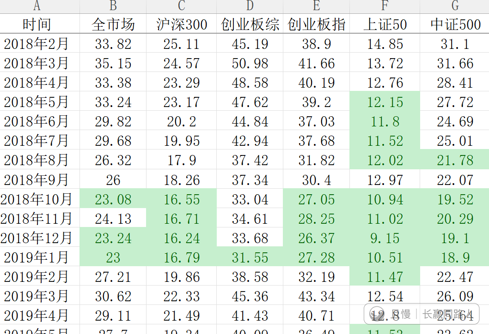
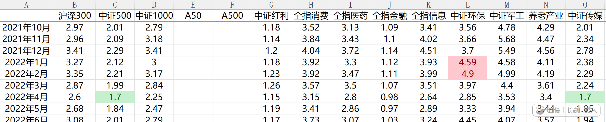

今天估值表出现了非常有意思，也非常反常的情况。

我亲自一笔一笔算A股各指数估值，包括PE和PB，已经有十几年了。

一般来说，A股的估值出现历史最高区域和最低区域，都是同时出现的。比如说图一、二、三这样。

很少很少出现说有的指数进入最高区域，有的指数进入最低区域。我看了一下，历史上2022年出现过一次。

图四。

当时环保是历史最高区域，最高摸到3000点。后来最低跌到1200，现在2100。

而图中绿色的中证500，当时5600，现在8700。

图中绿色的中证传媒，当时900点，现在1500。

今天再次出现这个情况了（几乎）。

因为全指信息就差一点点点点，PB就会变成红色。PE还差得远，盈利改善。

而医药、消费，PB全绿了。

消费只在2008、2018年两个区域绿过。医药除了这两个区域，在2024年也绿了几个月。

我绝对不是说信息要跌，医药消费要涨。大家一定要清楚，高不代表要跌，低也不代表要涨。我只是在跟大家描述客观数据。

现在它们只是在PB上进入了区域而已。区域里面的幅度也非常大，有多大？

全指信息的PB最高点，比最高区域的最低点，还要高87%！在疯狂的2015年5月，全指信息的PB到过12倍！（PE是200倍）——2018年钻石坑只有2倍多。

全指医药的最低点，距离最低区域的最高点，还要低17%。那是2008年金融危机的10月，当时全指医药的PB差点跌破了2倍。

能听懂吗？进去最高区域不代表一定跌，因为距离曾经最疯狂的最高点还有87%！

进去最低区域也不代表一定涨，因为曾经在危机中又跌了17%。

区域只是说这个位置，比历史上90%的时间都要便宜或者贵而已。数据只是数据。数据不承担判断走势的任务，数据就是数据。

ETF拯救世界
另外全指信息虽然说盈利改善，PE还没有到2015年的疯狂。但其实已经接近2007年了。2007年PE最高点其实就比现在高百分之十几。

> ETF拯救世界
> 已经70倍了。

> ETF拯救世界 > ETF拯救世界
> 作为对比，2026年财年的预测市盈率：英伟达：27。台积电：20。美光：8。三星：7。sk海力士：5。当然这些说白了也是强周期。不过它们在周期最强的地方就是这个估值。

Elaine.
现在医疗医药离最低区域的上沿跌了多少了呢

> ETF拯救世界
> 基本就是上沿，刚进。

刀疤博文
医药医疗还是业绩不够好

> ETF拯救世界
> 这个确实。利润增速不行。不过要是行也不会在这个时候干到这个地步。

ETF拯救世界
看到图中，中证医疗估值在2015年到过150倍……麻了。

> alekc
> 请问E大有没有应对未来再次出现“中证医疗估值在2015年到过150倍……麻了”的方案

> ETF拯救世界 > alekc
> 我认为99.9999999999%不可能出现了。那时候市场上一共就1000多只股票，现在5000多只，比美国还多40%！！！！

> 捡辣鸡捡到发财
> 现在多少倍😏

> ETF拯救世界 > 捡辣鸡捡到发财
> 当时的1/5左右。

红魔披头士
目前养老、医药、消费、中概这些我们持有的都毫无疑问是低估的，我自己持有的中药看数据也是低估。
而我手上80%以上的持仓都是这些低估值品种，所以哪怕账面数据不好看我也十分淡定。

> 红魔披头士 > 闲看云卷云舒
> 中药我以前在现价附近买过几笔，最后均以盈利30%+卖出了，现在只是又回到了我的波段买入区域。看估值的话，不管PE还是PB估值百分位都极低，不过我现在仓位很低，不到1%。