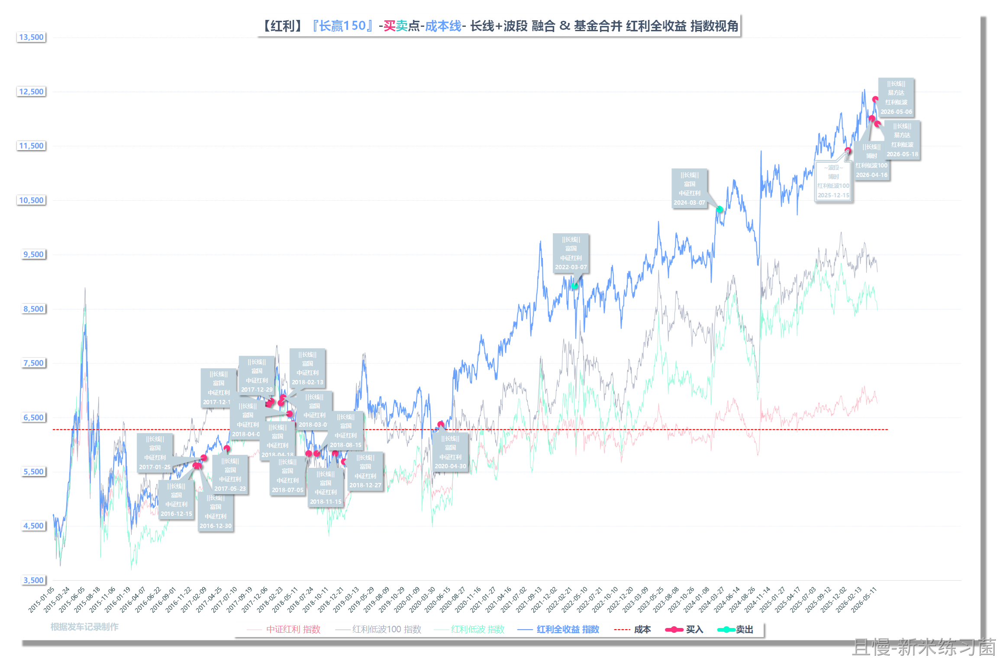
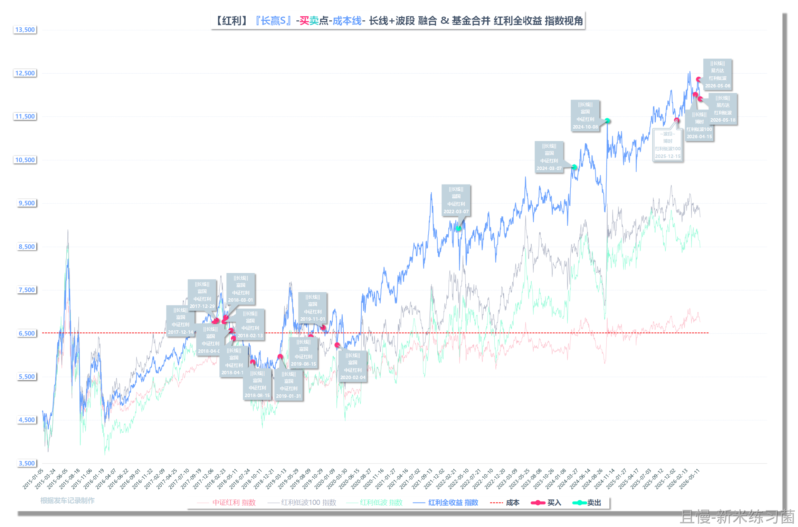

可别这么涨上去。至少要再买点红利100，最好还能再来点红利50。

最重要的，是那十几份富国红利还没换呢。

后续买入计划非常多，也已经制定好了交易路径。可别涨。

投资-小白
涨上去正好把富国卖了，跌回来又买红利100和50，波段的时候完成切换，我太机智了！

> ETF拯救世界
> 不能这样，容易卖飞。一定要先买后卖。因为先买没有坏处，最多多一些持仓。先卖如果错了问题就大了

新米练习菌
E大早上好
我更新一下目前红利相关的情况：
【150】
红利仓位：10.52%
目前红利共持有17份 = 富国 中证红利 x 13份+ 博时 红利低波100 x 2份 + 易方达 红利低波 x 2份
【S】
红利仓位：14.97%
目前红利共持有12份 = 富国 中证红利 x 8份+ 博时 红利低波100 x 2份 + 易方达 红利低波 x 2份
---
（附：指数视角交易图） 

