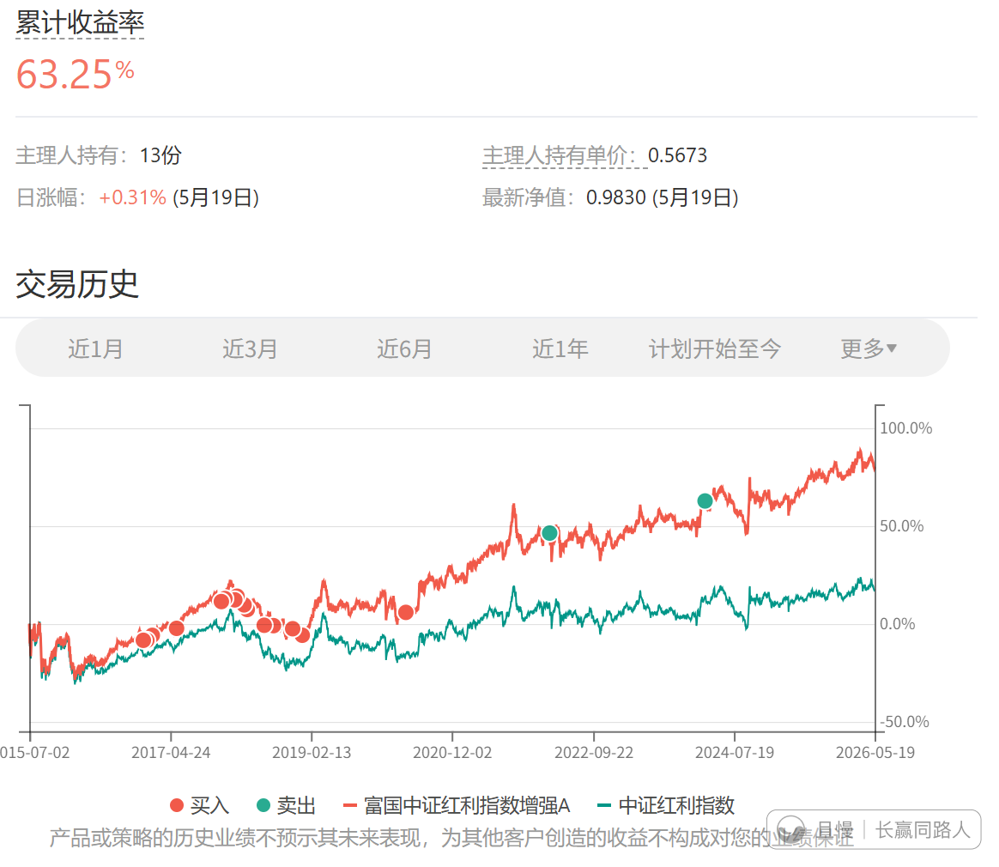
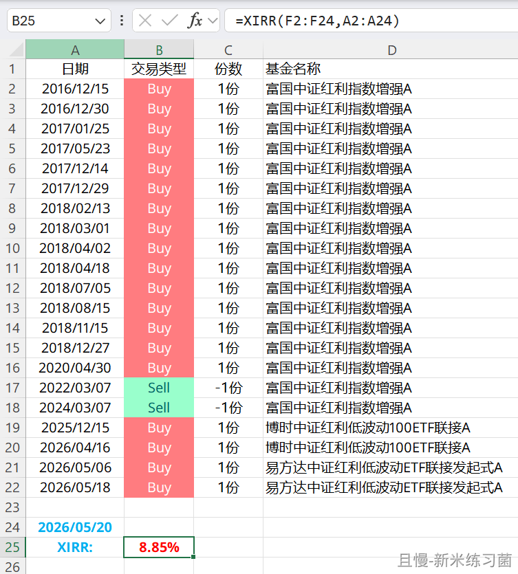
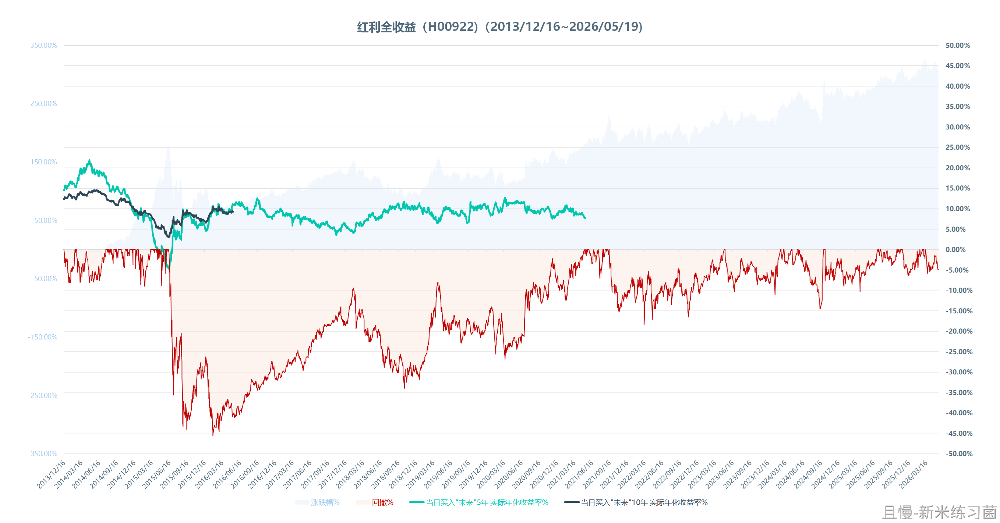
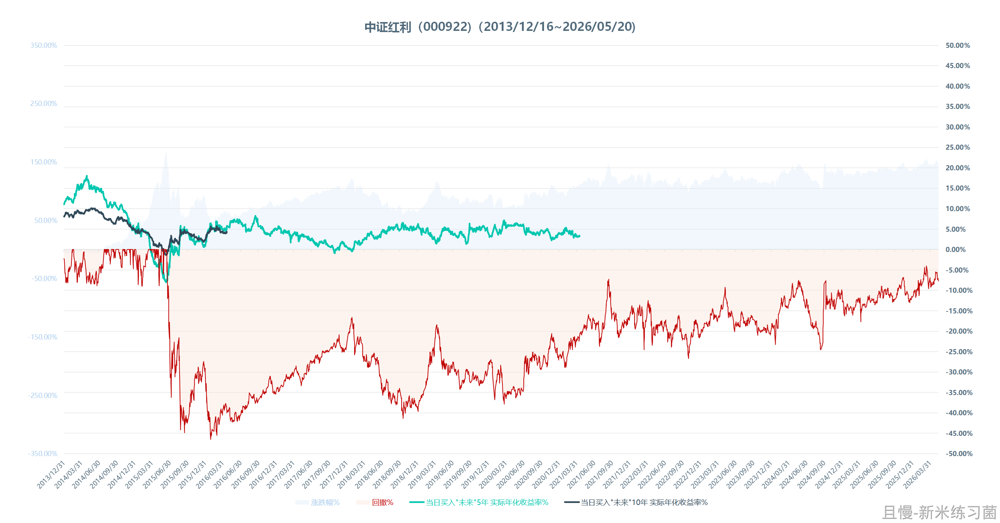
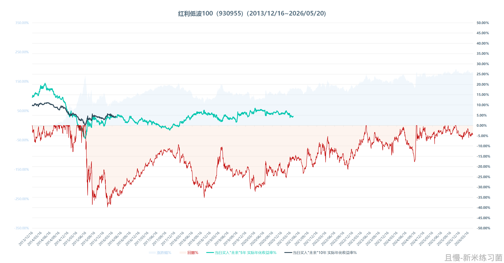
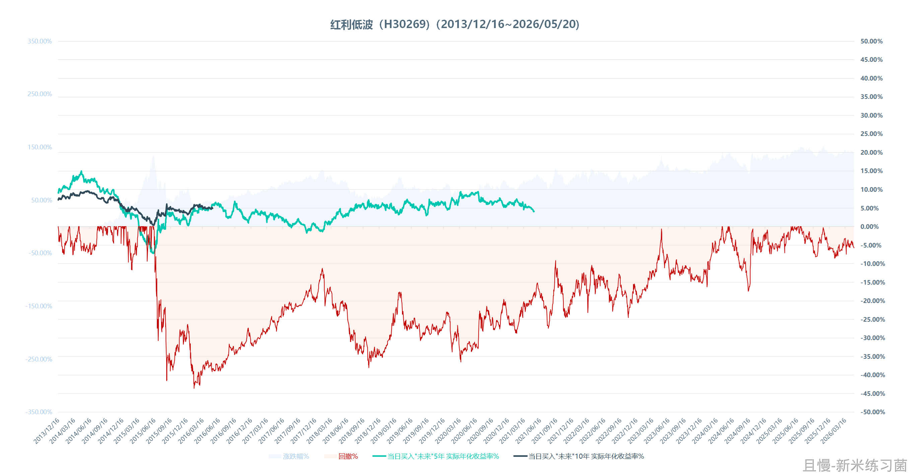

红利指数和基金的特点
今天在xhs，看到有很多人对红利以及红利低波这两年表现一般的抱怨。

我想聊聊到底如何对待这个品种，因为我觉得自己有点发言权，原因有二：

第一，2016年底我们开始在计划中布局红利。一直买到2020年结束。总资金收益率60%多，年化xirr我没仔细算，但是估计有7%-8%以上，应该是8%以上。它长期是计划的第一大单一品种仓位。我们有实战经验。今年再次开始布局。

第二，我对4个红利品种，跑了一共3万次以上的回测。20年的数据，经历过各种宏观环境，市场环境，应该是有参考性的。

在各位投资前，我希望各位了解它的特征。

1、相对低波动性与相对独立的走势。这个不用说了，通俗来讲就是别人大涨它慢慢涨甚至不涨。别人大跌它慢慢跌甚至不跌反涨。如果在“牛市”中持有，会比较难受——还记得2020年赛道行情中有人在微博骂我持仓红利吗。

2、低波动不代表没有波动。它也会跌，虽然跌幅不会特别大。除非遇到金融危机，基本上30%多的回撤就是极限了。比如红利低波100，最近十年内没有回调超过30%的情况。但它也会跌，千万别觉得买了不会浮亏。当然话说回来，什么不会跌呢？连债券都会跌。你没见过债券跌？你会见到的。

3、它的走势特点，一般来说是长期横盘或者小跌，小幅波动。然后在某个时期拉升一段，再横盘，再小幅波动。最关键的是，你不知道什么时候拉升一段。所以，想要赚钱，必须长期持有，才不会错过拉升。

4、预期收益率。长期看，5-10年以上，我不希望说太高的收益率让各位热情高涨。但是从我们的持仓和回测数据看……保守点，7%以上问题不会很大。除非宏观经济出现巨大的问题，百年未有的变局出现了。想要更高的收益，就得在大幅下跌的时候买进。

5、长期亏损概率。正确的方式投资，持有5-10年以上，还亏损的概率，从过去几十年的情况看，是0。当然未来不好说，没法给你保证。但是我相信不会差太多。

总而言之，它适合不想承受太大的波动风险（虽然20%-30%多的波动已经很大了，但对比其它指数，还是好很多），想要长期持有取得还不错的（历史看7%以上）年化收益的朋友。

不适合谁？不适合那些买了就想赚，想要短期赚大钱，而且不断和别的品种比的那些朋友。

品种是好品种，但不适合所有人。投资之前，请一定想清楚是否适合自己。

村长刘
红利最大的问题是牛市基本不动 别的标第都疯涨大家都挣钱时候就显得自己很傻X 买了就得长期持有

> ETF拯救世界
> 从历史数据看，5-10年区间，能跟美股掰手腕的只有红利。其它品种牛市大涨，然后就是大跌。对于操作以及运气要求过高了，很可能收益不行。

新米练习菌
E大早上好~
1）个人尝试用150的买卖记录（包括新买的4次两新红利品种，到目前为止的持仓，假设每一份买入为10000元）简单Excel算了下
年化XIRR：8.85%
2）想更新一些红利相关的《走势 & 5年/10年年化收益率% & 回撤 图》
【图2】红利全收益指数（H00922）包括分红再投入（更新到昨日）
另外三个是价格指数（更新到今日）
【图3】中证红利（000922）
【图4】红利低波100（930955）
【图5】红利低波（H30269）
---
（第4个品种，如果是红利低波50的话，抱歉，这个指数2017之前的数据，我还没扒到…前面还少一段，暂时没放）

