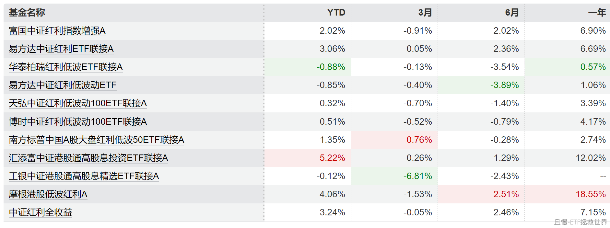
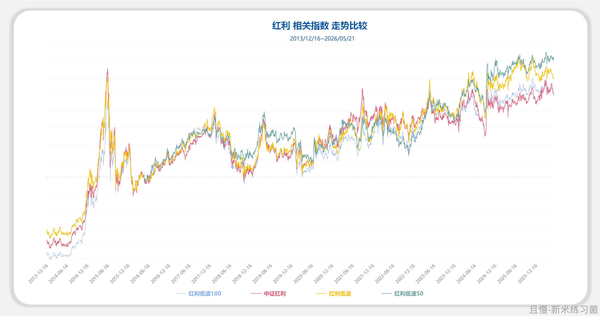
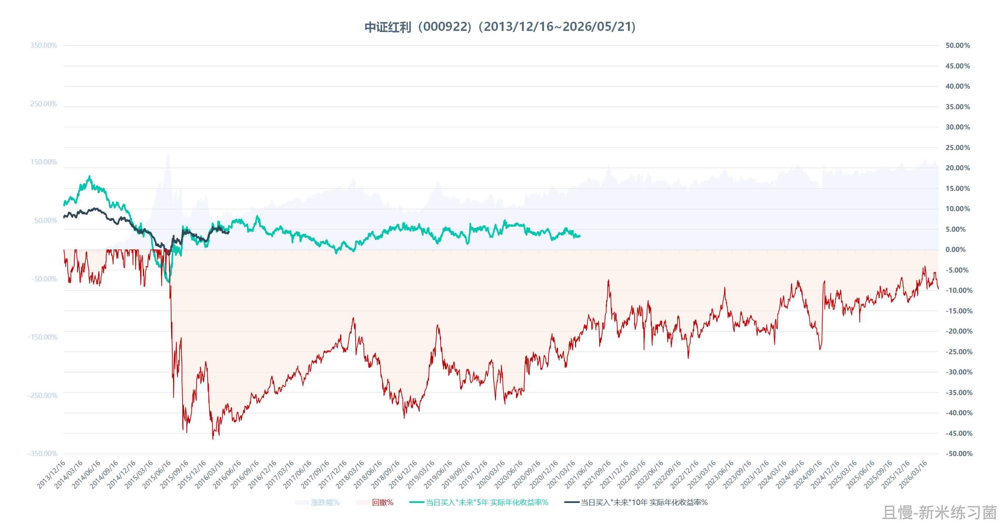

中证红利即将进入换仓的“买入”区间。会买入其它费率更低的品种，换掉为我们赚了大钱但费率更高的的富国红利（我们买富国的时候该低费率品种还未出现）。

之所以要先买后卖，而不是同时买卖或者先卖后买，有两个原因。

同时买卖会产生交易费用。

我们的申购费当然时不时的会返还给各位，但是基金的赎回费是没有办法免。我计划在买和卖之间，做出3个点以上的交易空间，不仅把赎回费做出来，还有一点点肉吃。

先卖后买就更严重。

先卖有可能卖飞。昨天说了，红利的特点是横盘一段然后拉起来一段。这样如果卖在拉起来之前，就可能买不回来。

交易方面，因为150有13份富国红利，如果一次一份，需要13次。如果一次两份，需要7次。看情况吧，有可能一次就换两份。

总而言之，即将进入先买的区间了。

小卡拉米橙子
对富国红利都产生感情了，特别是在熊市时接近10%的分红，老大提醒我们改为现金，增加投资子弹。确实费率高了点，当时没有基金新规和更多品种选择，跟车换挡，每年的养老金抵扣还指望小红呢

> ETF拯救世界
> 确实有感情。是真发钱啊。

狭窄的宇宙
再问一个，富国红利费率是高些，但这大半年表现好像比其它红利好些，是我错觉吗？

> ETF拯救世界
> 不是错觉，你的感觉非常对。主要是跟踪指数的走势不一样。但你放心，我们要换的更好。
> 

凡潇
E大，我有个问题，这里大部分人有份额，那我们没有份额的呢🤔多买两份吗？

> ETF拯救世界
> 跟着就行。

> 凡潇 > ETF拯救世界
> E大，谢谢您的回复。我想多问一句，最近美债跌得有点狠，150只买了四份，我个人多买了些，最近一直下跌，有点难受，翻阅了之前在微博的所有关于美债的记录，有几个点，一个是美债的大坑已经走出来了，其次收益率5.0，再就是如果不是限额的问题，会买更多，我们买的都是中短债，不用太过担心。我想问这个节点上，风险依然很大吗？可以补仓吗？可以详细说一下吗？我想这也是大家关心的问题。

> ETF拯救世界 > 凡潇
> 目前富国美债的久期大概是6年多，没有什么大问题。计划买入的话，我再观察一下。自己交易和一个那么多人的大型组合还是不一样的。

15层的猫
老大，有个疑问，就是这种操作，对于之前没有持有红利或份数不够的人来说（比如我自己），基于这次操作补齐了红利仓位，没问题吧？

> ETF拯救世界
> 你是说一笔补齐吗。我不好说。我的操作都是预留了很大的下跌空间的。

> 15层的猫 > ETF拯救世界
> 不是一笔补齐，就是按这个操作，您是先买2份新品种，我也会跟着买。然后再卖2份旧品种，我因为没有不会跟着卖。
> 这样下来，您的持仓没变，我的持仓跟您补齐了。之前一直没有这样的补齐机会。

> ETF拯救世界 > 15层的猫
> 那肯定可以啊。否则咱们的仓位不是永远没办法一样了。我之所以现在买一定是能买了。

也许有一天会很有钱吧
那我之前富国红利不多的话是不是可以多买一点，等你卖富国红利的时候我再出一点😃

> ETF拯救世界
> ？？？什么脑洞大开。我都要卖了你还买……

同路人_天地一沙鸥
E大，如果能抗住波动，能否用红利替代理财？

> ETF拯救世界
> 理财和红利还是不一样。

阿胜
钱几天不是刚买红利吗。又要换仓？不懂，求解

> ETF拯救世界
> 前几天买的，我估计十年都不会卖。

新米练习菌
做了个【红利】相关的四个价格指数比较的图
大方向一样，日常走势也会有分化的时候，有差异时交易不同的，会有些超额收益吧
（红利低波50，2016年5月之前的数据暂时还没扒到）
同时，更新一下中证红利的图

