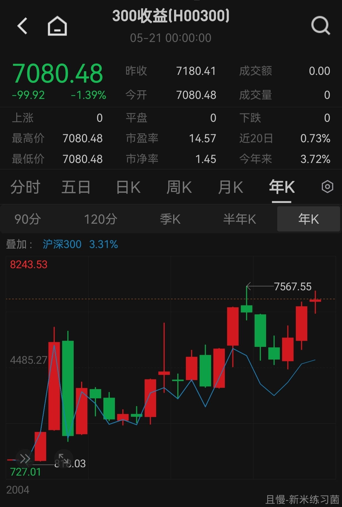
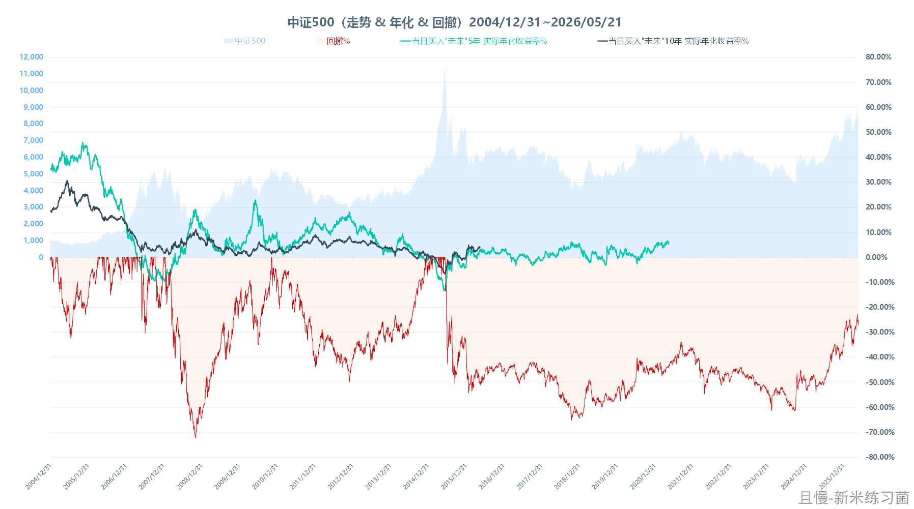

刚才跑完数据，不留神看到了一个细节，给哥气笑了。

也明白了为什么某些市场给投资者的感受如此之差。

我们用沪深300全收益指数来说，这个指数要比沪深300涨幅要高。换句话说，以下的数据，如果用沪深300来看，就会更差。

2006年2月27日，300全收益突破2005年3月的高点，开启了一轮历史上最长的新高后牛市。

这轮牛市长达1年8个月。你别笑，这就是沪深300历史最长的突破新高后的牛市。

接下来的事情让人啼笑皆非。

2007年10月17日见顶开始下跌后，经过2788天——你没看错，到了2015年6月，300全收益终于再创历史新高。整整接近8年以后。这8年，股民在回本。

最好笑的一幕出现了。

5天以后，300全收益再次见顶，又开启了一轮1857天的下跌。这一天的顶部，一直到2020年7月才回本。

5天啊！又开始艰辛的回本之路了！

又是5年。

这次不错，行情走了7个月才在2021年2月再次进入熊市。这一下，又是1919天，一直到现在。

又是6年，还没有新高。

这就是A股。

2007年10月至今接近20年，有18年在回本。

创新高以后上涨的时间，一共不到1年。

就问你NB不NB？感受为什么差？这就是答案。

新高后就暴跌，然后就是回本。再新高，再回本。1年新高，18年回本。

阿木木123
E 大会用 AI 训练自己的语料来发贴吗？我感觉我敏感了。

> ETF拯救世界
> 我没那个闲工夫。做研究每天晚上到1点，哪有功夫弄那些玩意儿。而且我喜欢写文章跟大家聊天。

ETF拯救世界
关键不是暴涨暴跌，而是时间。时间太长了，感受就特别不好。

ETF拯救世界
这不是沪深300不行。中证500到现在3994天还没有创出2015年以来的新高。11年了。

新米练习菌
【图1】拿手机看了一眼沪深300全收益&沪深300。
【图2】然后，上述数据，用沪深300（000300）视角看的话，是这样的画面，大面积的回撤，确实…一直在回本的路上…
从2002/01/04到今天，统计了5912个交易日，其中回撤为0%的日子，只有127天，占比仅2.1%，也没忍住，笑了一下。

新米练习菌
【留言2】【图3】中证500
从2004/12/31到今天，统计5191天，回撤为0%的日子，仅177天，也就是历史长创新高的日子，占比只有3.4%，2015年之后，目前还“未回本”

