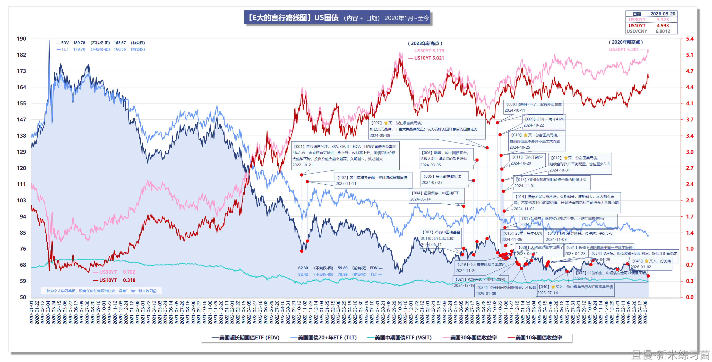
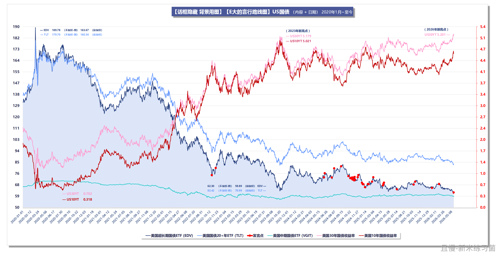

很多朋友搞不懂为什么说美债收益率变化，意味着债券价格波动。如果有影响，会影响多大？

前面的问题是基础问题。简单来说就是债券价格上涨，收益率下跌。价格下跌，收益率上升。是反的。

所以你最近看说美债30年期收益率涨到了5%，就是意味着美债价格下跌了。

那么涨跌幅度会有多少？

债券价格的短期涨跌，可以粗略用“收益率变动的百分点 × 修正久期”来估算。收益率上升，债券价格下跌；收益率下降，债券价格上涨。但这只是近似值，真实变化还受凸性、票息、期限结构变化和信用利差影响。

如果某只债券的修正久期接近30年，那么收益率上升1个百分点，价格大约下跌30%；收益率下降1个百分点，价格大约上涨30%左右，但实际涨跌会因凸性而有所偏离。

如果还是看不懂，就记住一个粗略算法：

债券收益率涨和跌1%，乘以债券的有效久期，就是债券价格的跌和涨百分比。

比如我们买的1-3年国开债，我们算它持仓债券平均久期2年。那么中国短期利率上升1%，粗略计算，我们的国开债就会跌2%。当然这是理论，时间拉长还有利息收入等等问题，实际跌不到2%。

所以你就知道，长期债券真的很吃收益率——比如30年久期债券，利率变化1%，意味着它就涨跌30%！

对债券不熟悉的朋友，还是尽量少碰久期10年以上的债券。

目前我们持仓的富国美债，久期是6-7年，还是比较舒服的。

望山山是你
说的就是我了……tlt和edv还选了个edv，现在只能呆着了……

ETF拯救世界
做网格。很舒服的。

> ETF拯救世界 > 望山山是你
> EDV 区间5%比较合适。最关键是即使出不去，也能吃息。比纯拿着好很多。但是最重要做好压力测试，不要拿太多钱做。降成本即可。

新米练习菌
我更新一下美债发言的笔记：
➡️看【图2】可以get到：债券价格和收益率“是反的”。
（图中红点只是发言的日子，不是交易；图中的基金只是用来看走势用，没有推荐和建议的意思。）
---
➡️所有的过往发言明细，合集更新在这个帖子里：
https://qieman.com/content/content-detail?postId=66229
（正在编辑）

