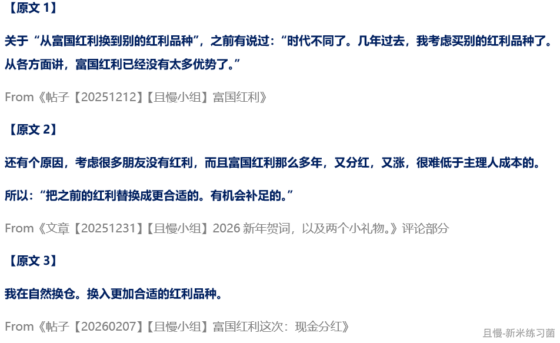

我看很多朋友误会我刚才说的换红利的操作了。

既然这么多年，我一直等到现在才换，就一定是认为目前我们的仓位，交易时机等等综合因素，也适合没有富国的朋友新买入。

如果我买新的品种你不买，那不是永远也不可能跟我仓位一样了吗。

新米练习菌
“富国红利那么多年，又分红，又涨，很难低于主理人成本的”，所以，不会有补仓提醒的，
换仓，没有持仓的就不用卖什么，但是可以自然地买入了，就有持仓了。
【图】一些原句回顾，至少半年前就开始计划安排了~

