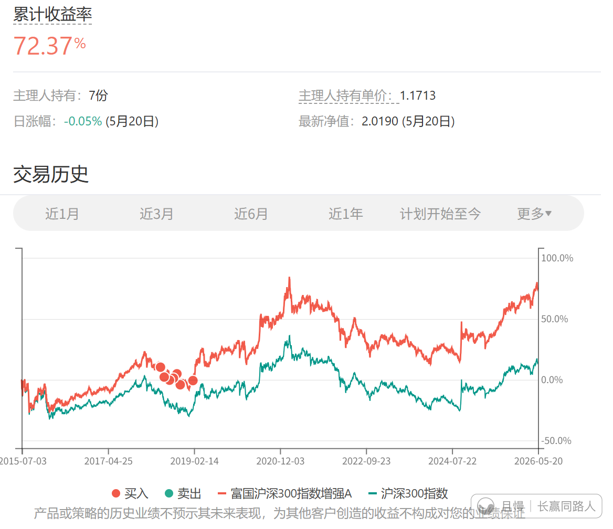
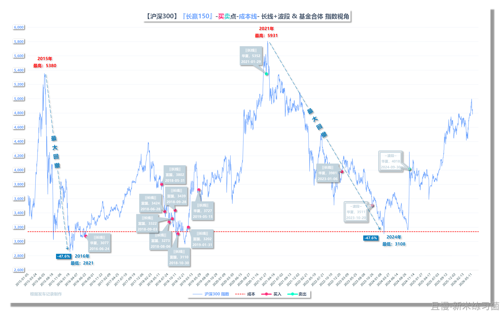

现在的市场真的差异巨大。

不仅是信息与医药消费的历史最高区间/历史最低区间的差异，甚至也有500这样的高分位，与300这样的已经低于历史平均的差异。

计划中的300我现在一定不卖。即使未来坐过山车也不卖。

至于这种低于历史平均估值品种的买，我的想法是，除非再跌十几个点（估值）回到最低区域附近。

否则，跟随中期动量。不能再让大家一买好几年才赚钱了。

（图中的300在2018-2019几乎是全都买在最低点，但是到了2024年居然还是没赚到什么钱，那么买在高位的呢？这市场真的绝了。）

新米练习菌
因为沪深300涉及到3个基金（富国&华夏A/C），还做过波段，我更新个对应的“基金合并&长短融合”的指数视角的图吧：

