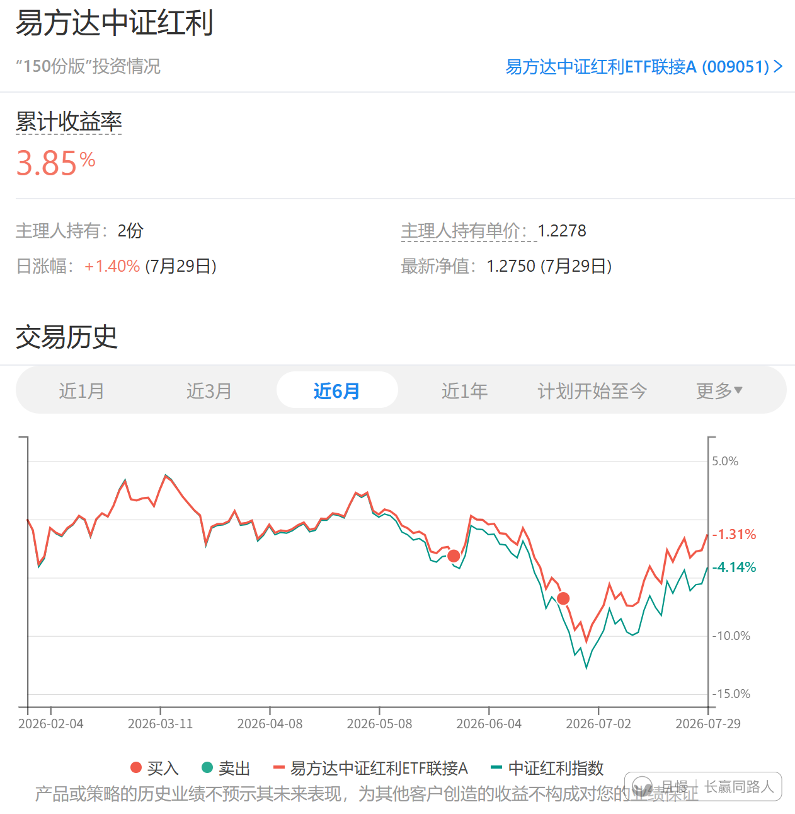
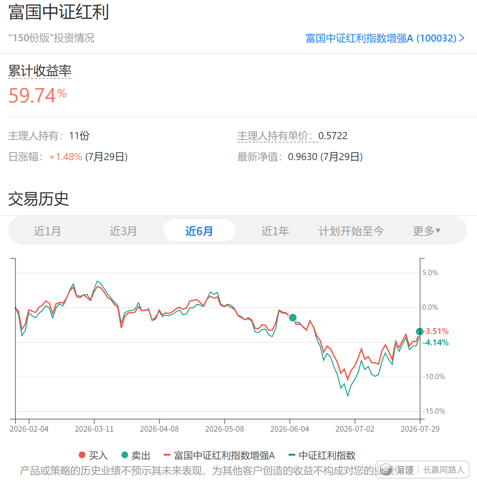
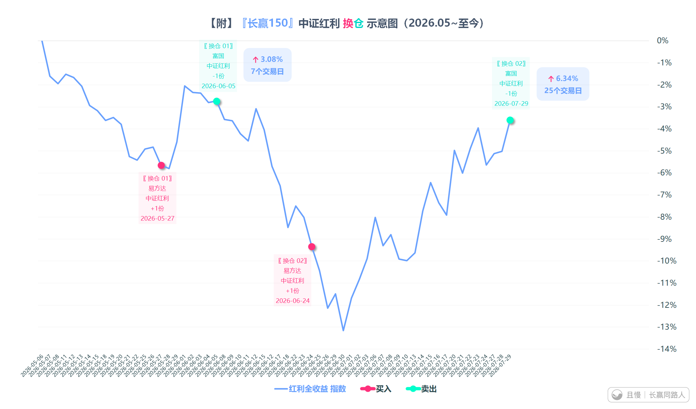

我之前说，会把持仓的高费率红利产品慢慢换成低费率的。

但是我不会在换仓过程中产生摩擦成本（也就是同时买卖因为申购+赎回费用发生损失），甚至每次换仓我要赚钱，3个点起。

今天第二笔换仓结束。

第一次是8天3个多点换仓收益。今天是一个月5个多接近6个点。

我说了就要做到。说的时候你不信，我会做到你信。

另外再说一次，持仓富国是因为2016年买的时候，红利基金非常少，没有现在这么多选择。现在有了更好的选择，会换过去。当然这些年富国红利为我们赚了60多个点的收益，也很感激它。

这种赚钱的换仓过程，如果你实在不理解，其实你也可以理解为某种网格波段。这样就好懂了。

只是这是一种不同产品间的波段而已。

（图三新米提供）

