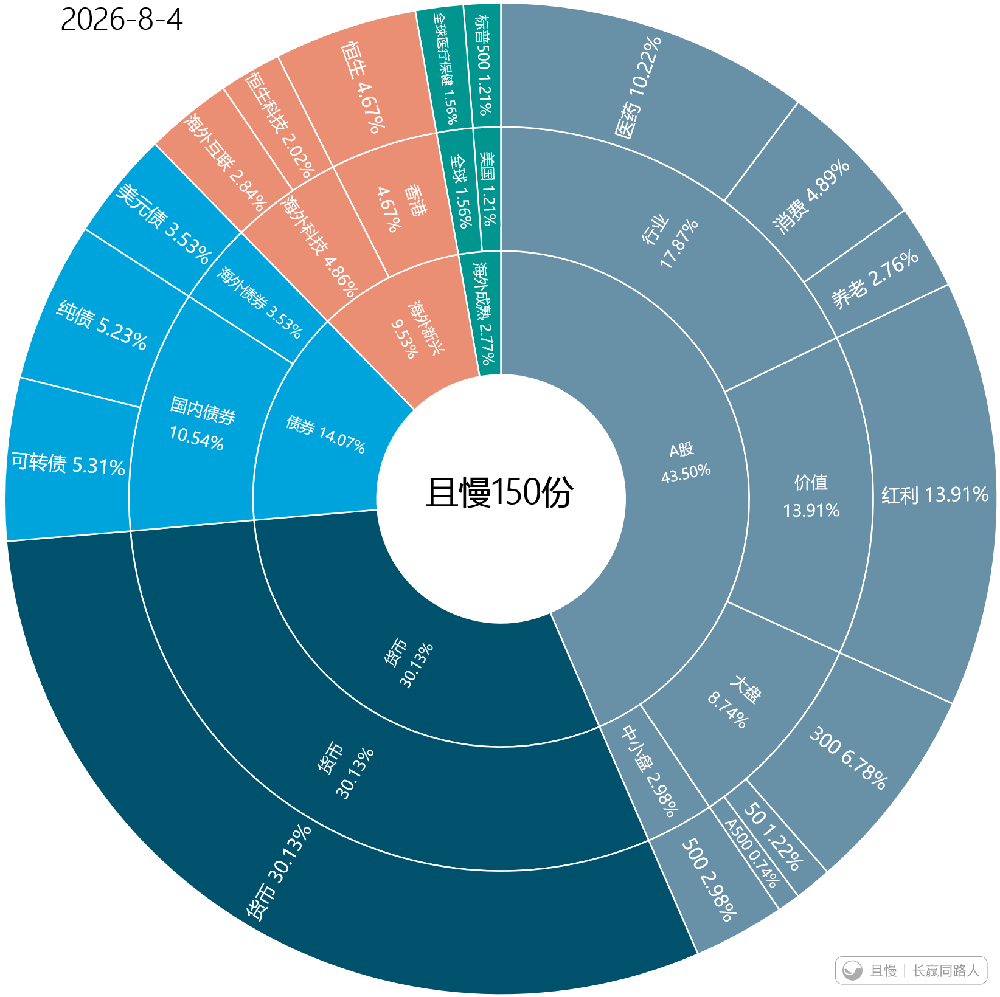

这次买A500，我看最多朋友问的是，便宜吗？好像不便宜，为什么买？

以我越来越深的体会，在证券投资领域，便宜当然是非常重要，甚至可以说最重要的一个因素。然而，它必然不能是所有因素。

我想，决定一个品种该买还是卖，至少还要考虑：

我目前的资产配置是否合理，还缺什么，又多了什么；

我这一笔交易，是为了长期持有，还是为了波段操作降低成本增加利润；

目前这个品种的状态如何。短期是否跌太多，又是否涨太多。技术形态如何，是否有交易机会。

以A股宽基来说，我们在6月大量卖出中证500指数，导致宽基配置越来越低。在十个点的空间跌出来以后，买回一份是否可以是考虑的选项？

安全性来讲，A500的估值小于中证500，虽然科技行情中弹性略低，但又强于沪深300。这又是一个平衡的选择。

至于长期还是短期，技术形态的问题，篇幅所限，也避免又有人说我发言太多，就不再解释了。

向天一笑
老大，港股及港股通红利大概什么位置可以考虑？

> ETF拯救世界
> 其实6月港股红利的形态和A股红利的基本一样了，可以一起买。只是我们短期买太多了，还没来得及加就涨了。下次看看有没有机会。

QT123
是不是也可以考虑量化指增

> ETF拯救世界
> 量化指增说起来容易，其实很难。因为一个品种阶段表现好，又可能下一个阶段很差。你看我们的富国500，建信500，它们有些阶段表现很好，但在这一波上涨中是否表现的比华夏500好。

E..
A500和500的相关性大吗？和沪深300相比呢？e大是想要以A500取代500的位置吗？

> ETF拯救世界
> 300、500、A500的走势一定是一致，相关性非常非常高。不同的是在不同阶段会有涨跌幅的区别。A500是其它两个指数的一个折中状态，涨跌都是。

托斯卡纳酒桶
先收藏，周末仔细连起来仔细看。
老大，可否再讲下卖出全指金融的逻辑呢。我查看了等权和加权PE PB的估值（五年 十年 历史），自身绝对估值也不高。有点摸不着头脑了。

> 托斯卡纳酒桶
> 另外，全指金融bbi周k已经一周站上了，这周还没结束。Macd也有翻红迹象。
> 说的不对，还请大家多多指教。

> ETF拯救世界 > 托斯卡纳酒桶
> 金融确实不贵，超长期看其实也是不错的品种。但我们这个计划有很多需要考虑的因素，不适合再持有它了。而且它虽然是不错，但也未必到特别好的状态，红利完全可以在配置上替代它。

