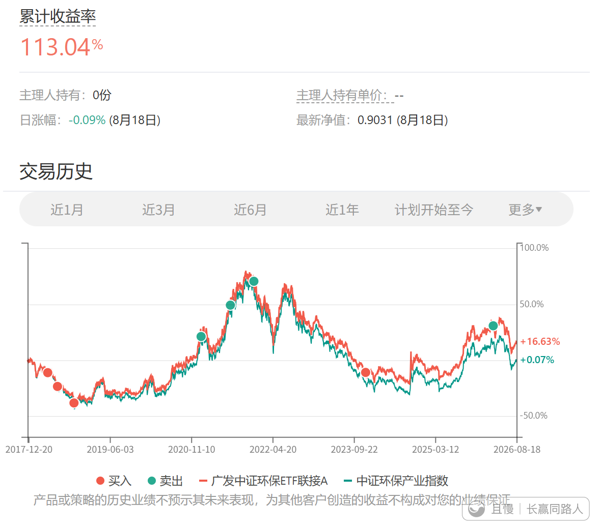
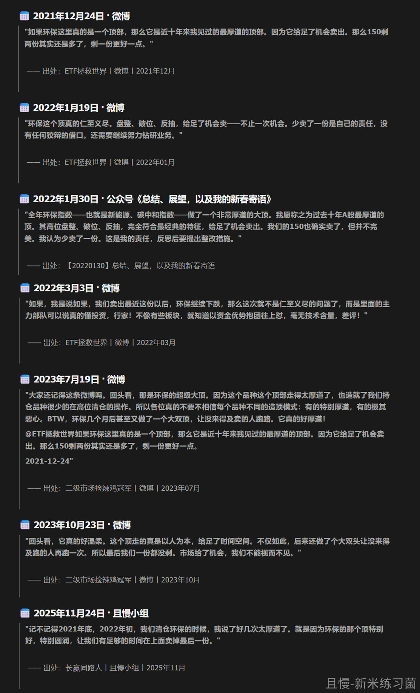
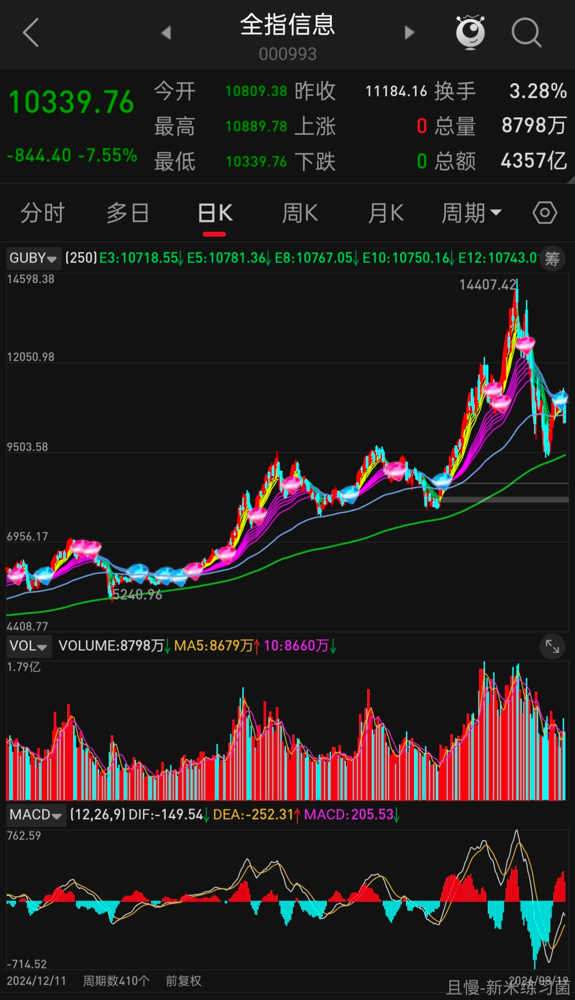
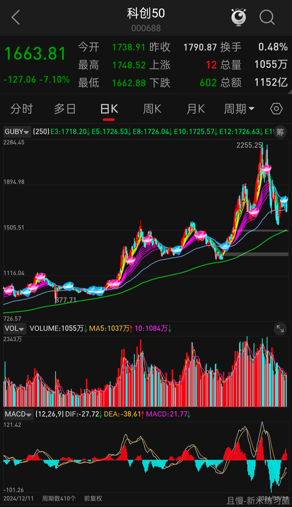
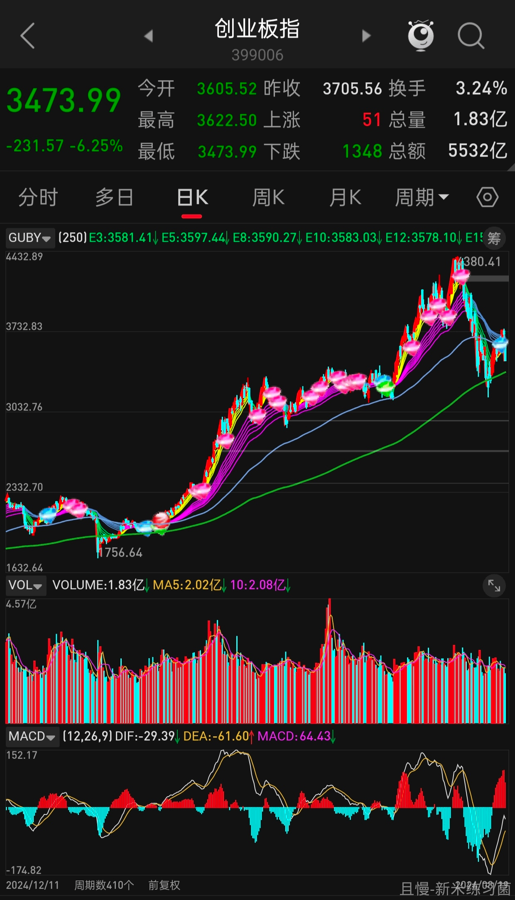

新手朋友要明白一件事。关于抄底。

你看好的品种暴跌，抄底也许没有错。或者说你看到有反弹迹象跟进去也可能是对的。

但你要理解，从来没有一个事后看暴跌几十个点的品种是一路跌下去的。因为如果持续暴跌，谁也跑不了，基本是不可能的。

一定是暴跌，反弹（引诱接盘），继续暴跌，继续反弹。

我想，暴跌中要不要抢反弹，最关键的还是这个品种的品质。有品质的东西，低位买不会错。但如果本来就是纯炒作，价格贵到天际，这个时候抢反弹不是说肯定不会失败，只能说需要很多好运的加持。

老朋友一定记得，2022年我一再说环保是我见过最厚道的大顶。是因为当时它的第二个高点几乎回到了左边的高度。那时候的减持太舒服了。

可惜，不会是每个暴跌品种都会这么厚道。各位抄底一定要小心。

而且，如果你被第2波反弹骗进去，那么凄惨程度恐怕远超你的想象。我说的厚道，是对能看清楚情况，并且在左边的高点没来得及跑的人而言。

新米练习菌
环保厚道顶发言回顾：

新米练习菌
瞥了一眼 三个“暴跌中有反弹”的品种…

新米练习菌
环保卖出属于 技术面与价值面 完美配合的经典案例。
估值高位，
“环保指数市值前40位公司TTM PE。算术平均75，去掉两个超过200倍的极值，算术平均61。”—— 来自 2022年3月4日 微博
技术完美，
指数在顶部先做了非常经典的圆顶，技术线慢慢靠了上来，盘整→破位→反抽→再做大双头的形态，给足了投资者从容卖出离场的机会。
"过去十年A股最厚道的顶"~

