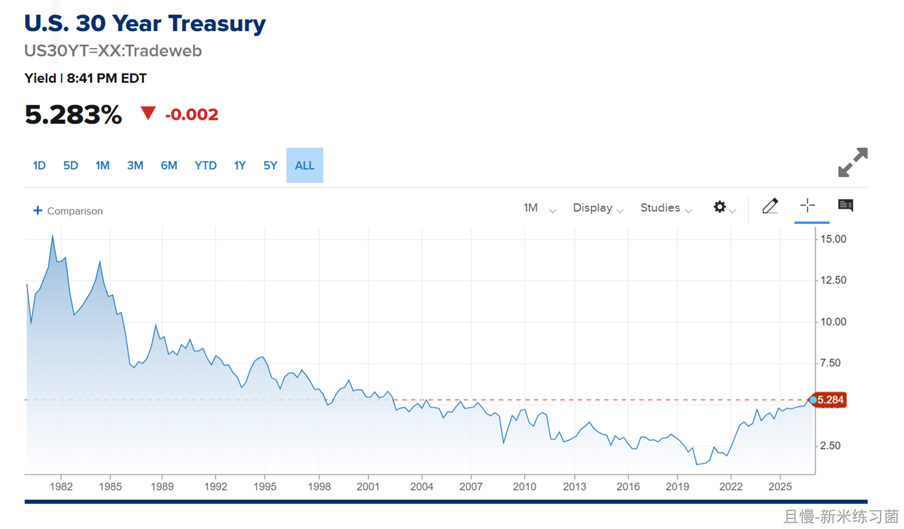
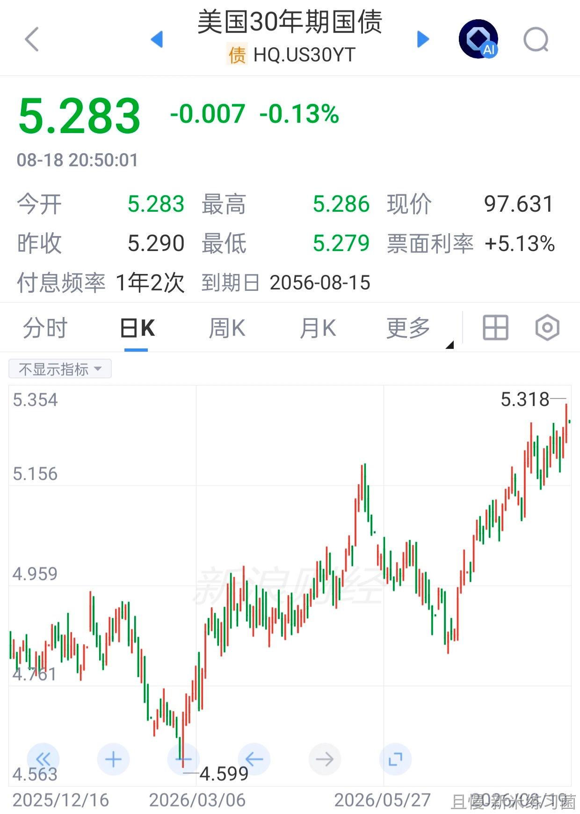
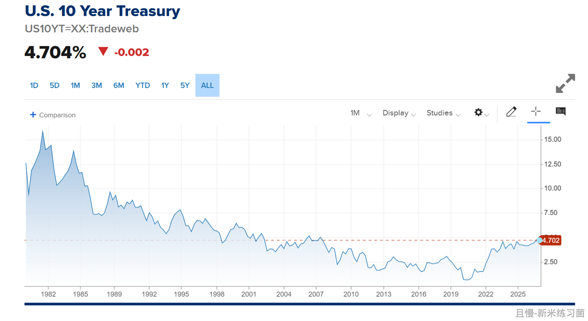

早上起来，运动洗漱之后，给小C布置了一个昨天晚上想到的投资小程序。

目前喝着冰美式。有些话想跟大家说，又不知道怎么说。想来想去，还是闭嘴。

你有什么想说的或者想让我可以用几句话回答的话题吗。

博松best
老大我攒了几十万，想靠投资慢慢增值，以后争取不用打工。但是选择继续攒钱加投资就要放弃结婚生子，选择结婚生子就得全花光还得欠些，以后也不会再有机会，有些迷茫。

> ETF拯救世界
> 等一下。你结婚生子马上这几十万就会花完吗。都花在哪里啊……另外，你现在有结婚对象谈论论嫁吗。如果没有，不要想这么多。

我是阿远
恒科中概还有希望吗

> ETF拯救世界
> 怎么理解你说的希望？我不建议把所有的希望寄托在某个单独品种上。目前150中概恒科5%不到，S是9%，但S实际上有很多现金，仓位比这个低。这个品种，我建议不要放弃吃波段。我们的计划也会用它们增加波段。

MrLin
老大想买30年美债有什么好的建议，有笔准备买房的钱，现在感觉不太适合买房，想买美债可以吗？

> ETF拯救世界
> 不建议买30年美债。如果你的钱在外面，sgov或者boxx。最多最多SHY。因为你这笔钱是随时会用的。钱在里面的话，你怎么买30年美债。

正经人谁炒股
E大，挑三两只股息稳定的个股，用十年二十的时间反复波段拿到足够足够多的筹码，把成本做到0以下稳定分红收息，这个思路怎么样🤪

> ETF拯救世界
> 个股的最大问题：你真的不知道几十年后它是什么样，甚至还有没有。

浩子1943
E 大，今年中证500还会有操作吗（买/卖）？

> ETF拯救世界
> 如果涨到夸张会继续卖，清仓也行。买的话很难了。

哄哄123
老大，我记得您说过美债仓位至多5-8%，我美债的仓位还没有达到仓位，现在买中短期的美债加满仓位，合适不？

> ETF拯救世界
> 我觉得中短债慢慢加问题不大。

> ETF拯救世界 > ETF助我养只小猫咪
> 富国美债是中期及以下。其它的也没有长期的。

凡潇
E大早上好，美债收益持续新低，我真的很好奇，为什么我们买的品种都是买了之后就持续新低，心力交瘁

> ETF拯救世界
> 我很难同意你说的“都”。目前两个计划持续跟投的朋友里面，有90%盈利。试问，如果我们买的都是不停新低的，怎么可能9成朋友盈利？你说的问题当然会有，因为我们就是在“低买”。这个买入方式注定了会有一部分品种买了会继续跌。

程彬
E大，我自己做了一个投资计划，50%的长赢，50%的现金流计划。现金流计划如下:45%红利低波100+20%标普500+10%纳斯达克100+10%黄金+15%短融。今年建底仓+每年定投，红利的底仓是跟着长赢再买已经开始。看看E大是否愿意点评两句。给些建议。🙂

> ETF拯救世界
> 挺好的。45的红利可以分一点给宽基。A500就行。宽基无论如何还是要的。

Ningx
小朋友明年上小学 听说大家都已经课外提前学 让我这个想躺平的西城妈妈有点焦虑 事实真的是这样吗 不补课不行吗😮‍💨

> ETF拯救世界
> 看孩子资质吧。资质够了应该不用。不够的话，能接受落后也不用。电影院里别人站起来了，你不站，确实看不到电影……但是小学应该没有太多必要吧，培养好学习习惯更重要。中学是另一回事了。

噼里啪啦2025
老大，在某些市场十年年化8%是什么级别呢，请教请教

> ETF拯救世界
> 看持续多久，看回撤幅度。如果长期年化能稳定8%，是很不错的。快赶上红利历史收益率了。

焰九霄
e大建议我们普通人大量配置境外资产吗？比如sp500。我知道这些不能放计划里，您建议我们自己配置吗

> ETF拯救世界
> 如果有好的机会（最高点回撤20%-40%的时候），买入一部分作为基础配置是不错的。

斐波那契
中概互联和恒生科技这两难兄难弟还要多久。还有个憋了很久问题其次E大之前帖子里表示500也不卖出了，但510500在高位，如果到9元还是不卖吗？为啥？

> ETF拯救世界
> 也不是不卖，够疯就卖。主要是500的仓位极低了，卖不卖问题都不大了。

E大的粉丝
您最近状态怎么样？有开心点吗？ 作为这个年龄的生活博主，您日常会吃什么补剂吗？

> ETF拯救世界
> 每天一大把。单独的复合维B和一份综合补剂。

肥仔_
E大，我有个问题，一些指数基金，买入后，会有一些炒的泡沫很高的股票纳入该指数的成分股，那我们选择标的的时候要避免这种基金吗？其实是担心不知道这个市场还有哪些东西是适合买的（除红利之外）😭

> ETF拯救世界
> 正常情况下市值型的指数基金都会如此。正常市场这也是指数基金能“不死”的原因。某些市场的问题是很少有公司能持续好，绝大多数是周期，这就导致了炒作——纳入——暴跌——指数不涨的轮回。但是这个问题也没法避免，只要买指数基金。

乐乐吧
老大，最近（周内）有没有发车的计划？😊😊

> ETF拯救世界
> 目前看应该没有。想买的还没跌到位，想卖的涨的不够疯。目前的仓位算是舒服。

鲸尾
长期持有市场公认那几只头部收息股吃股息，和全球市场资产配置（qdii），哪个更适合当做主要策略长期持有？

> ETF拯救世界
> QDII非常好，但它不适合全部投入。原因很多，主要是地缘问题，要考虑投出去的会不会在某一个时间点遇到麻烦。另外，即使没有地缘问题，合理的资产配置也不可能是全部投入外国资产，任何国家的人都是如此。如果风险承受能力强，很想把QDII作为大资产配置，也应该至少是30%本国，70%全球。

新米练习菌
E大早上好~
美国30年国债收益率“也”“又”新高了。创2007年以来新高。

> 新米练习菌
> 嗯，30年的，但10年的还没。
> （只是觉得一个国家ZF的债务40 万亿美元，一年还利息就要1万亿美元+，觉得不可思议。）
> 之前配的债券价格又有下跌了，仓位还不到的话，可以继续再配置一些中短债吗？
